---
hide:
  - toc
---

<label for="site-language">Language</label><select id="site-language" data-language-select><option value="en">English</option><option value="ja">日本語</option><option value="de">Deutsch</option><option value="it">Italiano</option></select>

  
<h2 data-i18n="productGallery">Product Gallery</h2>
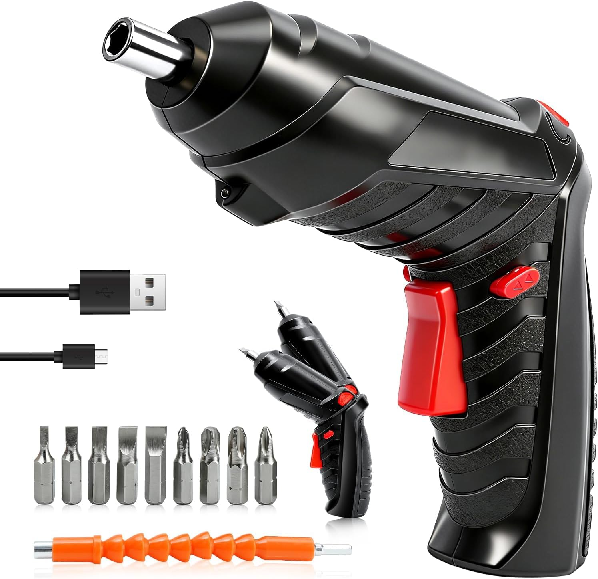

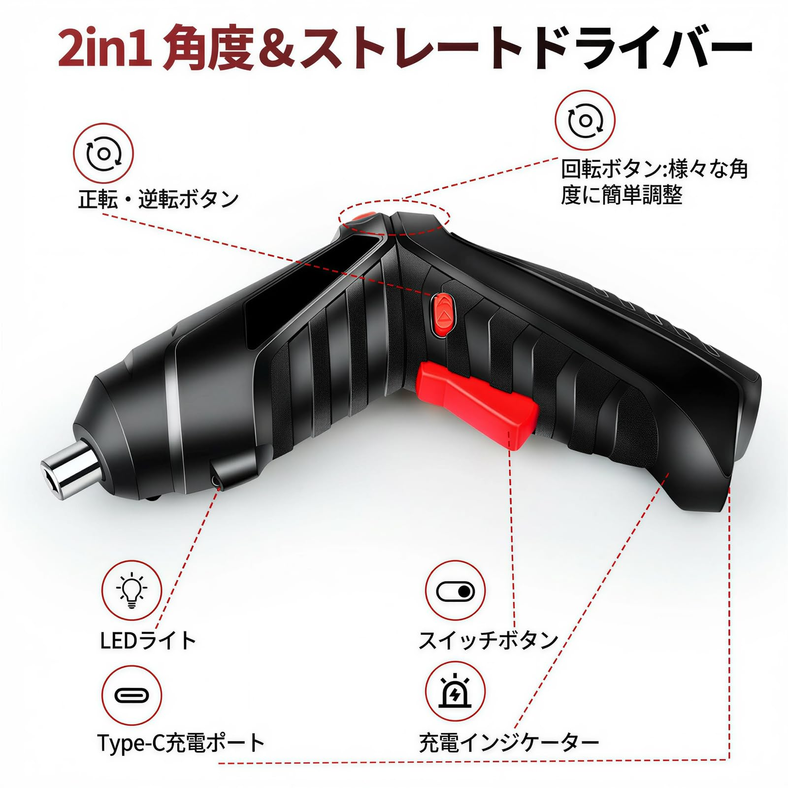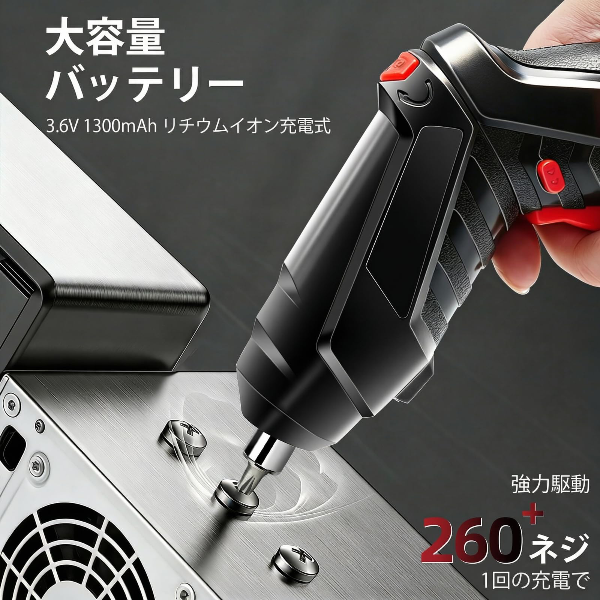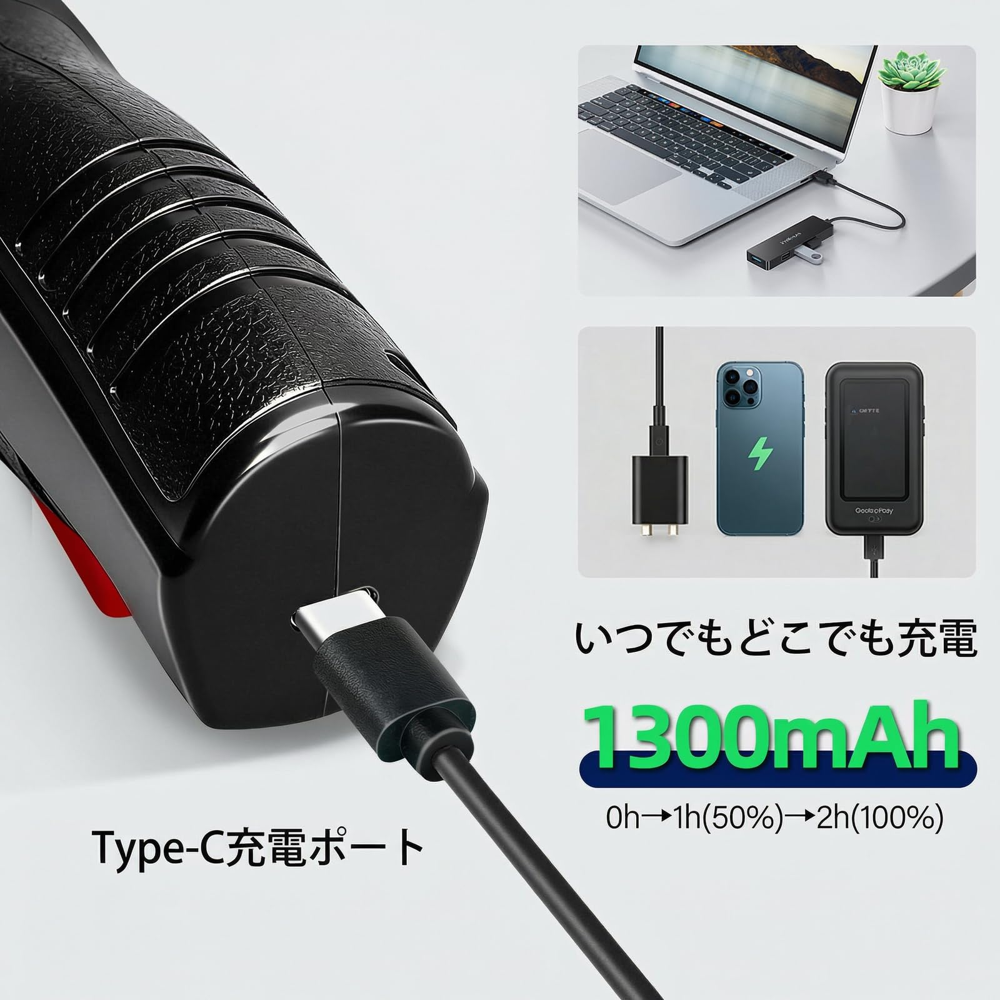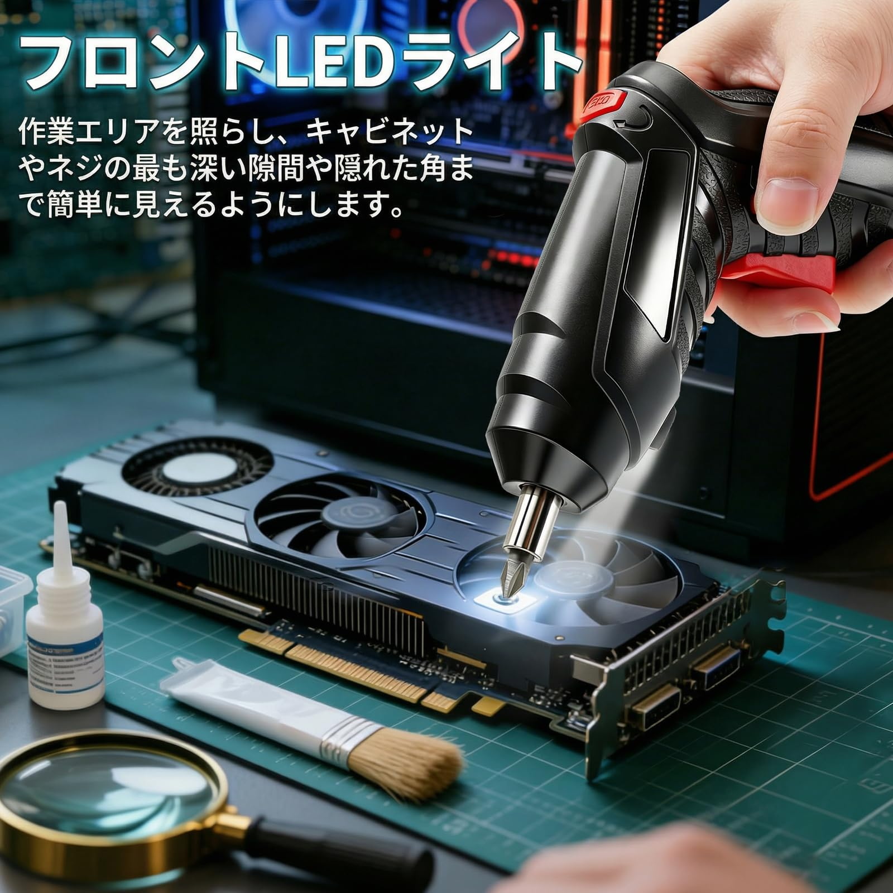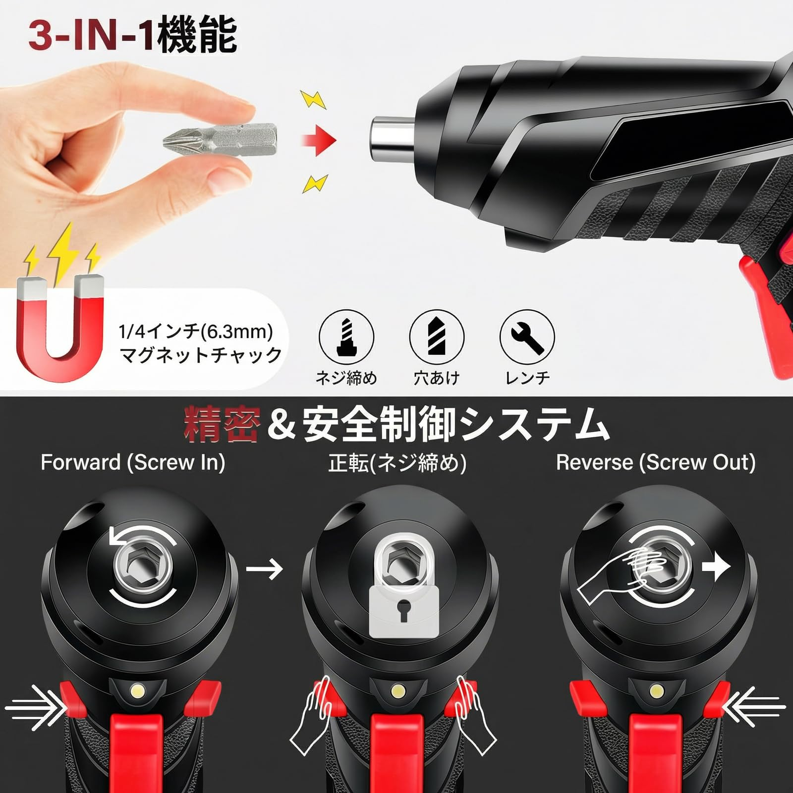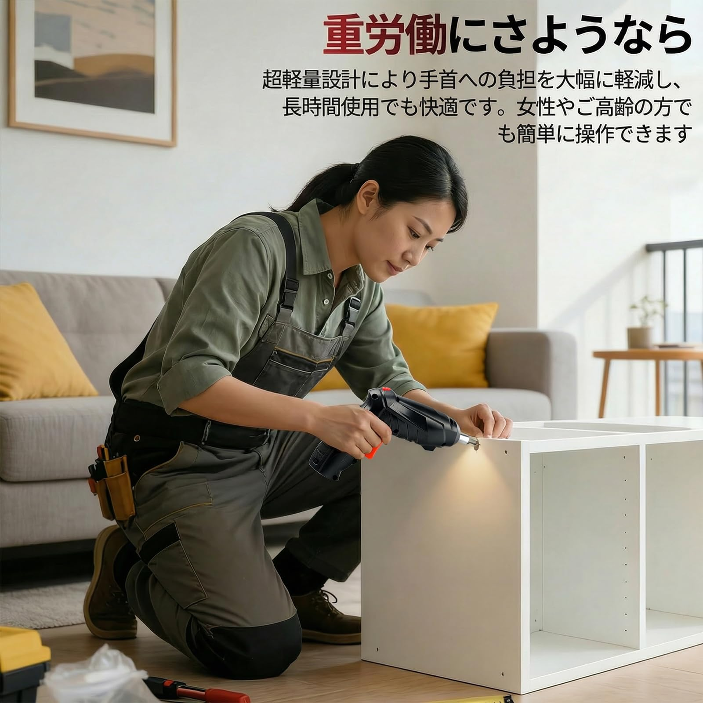

  

Home / Cordless Screwdrivers / B09YRDY3YS

Price shown on Amazon

ASIN: B09YRDY3YS
<a class="amazon-buy" href="https://www.amazon.com/dp/B09YRDY3YS" target="_blank" rel="nofollow noopener" data-i18n="viewAmazon">View on Amazon</a><a class="amazon-secondary" href="../" data-i18n="backCatalog">Back to catalog</a>

<section data-lang-content="en">
  <h1>Goldsea 4.2V Mini Electric Screwdriver</h1>
  
Compact cordless screwdriver with manual/electric 2-in-1 operation, 3.5 N.m torque, 1500 mAh Type-C charging, 10 screwdriver bits, LED light and a 90°/180° transformable handle.

  <h2>Product Features</h2>
  <ul><li>2-in-1 manual and electric operation for flexible fastening control.</li><li>3.5 N.m electric torque with a 1500 mAh battery for improved work efficiency.</li><li>Type-C rechargeable design supports repeated charging and about 60 minutes of continuous use.</li><li>10 CRV screwdriver bits with magnetic chuck make bit changes fast and simple.</li><li>Compact 400 g body with anti-slip grip and transformable 90°/180° handle for tight spaces.</li><li>Forward/reverse switch supports both tightening and loosening screws.</li></ul>
  <h2>Specifications</h2>
  <table><tr><th>Voltage</th><td>4.2V</td></tr><tr><th>Battery</th><td>1500 mAh</td></tr><tr><th>Speed</th><td>230-280 rpm</td></tr><tr><th>Runtime</th><td>60-70 minutes</td></tr><tr><th>Torque</th><td>3.5 N.m electric / 10 N.m manual</td></tr><tr><th>Bits</th><td>10 pcs</td></tr><tr><th>Charging</th><td>Type-C</td></tr><tr><th>Light</th><td>LED work light</td></tr></table>
  <h2>Selling Point Analysis</h2>
  <ul><li>Goldsea 4.2V Mini Electric Screwdriver has a clear use case in Cordless Screwdrivers, making it easy for buyers to understand the practical value.</li><li>The uploaded screenshots provide strong feature evidence that can be converted into readable product copy.</li><li>The page separates purchase-focused product images from A+ detail visuals, matching an Amazon-style buying flow.</li><li>The feature list emphasizes runtime, accessory bundle, safety, usability and maintenance benefits where applicable.</li><li>The Amazon CTA keeps checkout simple while the landing page improves SEO and product explanation.</li></ul>
  <h2>Q&A</h2>
  

What is this product best used for?

Goldsea 4.2V Mini Electric Screwdriver is best used for cordless screwdrivers tasks and everyday project workflows.

Where can I buy it?

Use the Amazon button on this page to open ASIN B09YRDY3YS.

Does the page use uploaded images?

Yes. The main gallery uses product-images, while A+ detail visuals are shown below the product content.

Is live pricing shown here?

No. Prices change often, so live price and availability should be checked on Amazon.

What are the main selling points?

The main selling points are practical use, clear accessory/value bundle, easier operation, and a direct Amazon purchase path.

Can more details be added later?

Yes. Add more screenshots or text files to the ASIN folder and the page can be regenerated.

</section>
<section data-lang-content="ja">
  <h1>日本語訳: Goldsea 4.2V Mini Electric Screwdriver</h1>
  
日本語訳: Compact cordless screwdriver with manual/electric 2-in-1 operation, 3.5 N.m torque, 1500 mAh Type-C charging, 10 screwdriver bits, LED light and a 90°/180° transformable handle.

  <h2>商品特徴</h2>
  <ul><li>日本語訳: 2-in-1 manual and electric operation for flexible fastening control.</li><li>日本語訳: 3.5 N.m electric torque with a 1500 mAh battery for improved work efficiency.</li><li>日本語訳: Type-C rechargeable design supports repeated charging and about 60 minutes of continuous use.</li><li>日本語訳: 10 CRV screwdriver bits with magnetic chuck make bit changes fast and simple.</li><li>日本語訳: Compact 400 g body with anti-slip grip and transformable 90°/180° handle for tight spaces.</li><li>日本語訳: Forward/reverse switch supports both tightening and loosening screws.</li></ul>
  <h2>仕様</h2>
  <table><tr><th>日本語訳: Voltage</th><td>日本語訳: 4.2V</td></tr><tr><th>日本語訳: Battery</th><td>日本語訳: 1500 mAh</td></tr><tr><th>日本語訳: Speed</th><td>日本語訳: 230-280 rpm</td></tr><tr><th>日本語訳: Runtime</th><td>日本語訳: 60-70 minutes</td></tr><tr><th>日本語訳: Torque</th><td>日本語訳: 3.5 N.m electric / 10 N.m manual</td></tr><tr><th>日本語訳: Bits</th><td>日本語訳: 10 pcs</td></tr><tr><th>日本語訳: Charging</th><td>日本語訳: Type-C</td></tr><tr><th>日本語訳: Light</th><td>日本語訳: LED work light</td></tr></table>
  <h2>セールスポイント分析</h2>
  <ul><li>日本語訳: Goldsea 4.2V Mini Electric Screwdriver has a clear use case in Cordless Screwdrivers, making it easy for buyers to understand the practical value.</li><li>日本語訳: The uploaded screenshots provide strong feature evidence that can be converted into readable product copy.</li><li>日本語訳: The page separates purchase-focused product images from A+ detail visuals, matching an Amazon-style buying flow.</li><li>日本語訳: The feature list emphasizes runtime, accessory bundle, safety, usability and maintenance benefits where applicable.</li><li>日本語訳: The Amazon CTA keeps checkout simple while the landing page improves SEO and product explanation.</li></ul>
  <h2>よくある質問</h2>
  

日本語訳: What is this product best used for?

日本語訳: Goldsea 4.2V Mini Electric Screwdriver is best used for cordless screwdrivers tasks and everyday project workflows.

日本語訳: Where can I buy it?

日本語訳: Use the Amazon button on this page to open ASIN B09YRDY3YS.

日本語訳: Does the page use uploaded images?

日本語訳: Yes. The main gallery uses product-images, while A+ detail visuals are shown below the product content.

日本語訳: Is live pricing shown here?

日本語訳: No. Prices change often, so live price and availability should be checked on Amazon.

日本語訳: What are the main selling points?

日本語訳: The main selling points are practical use, clear accessory/value bundle, easier operation, and a direct Amazon purchase path.

日本語訳: Can more details be added later?

日本語訳: Yes. Add more screenshots or text files to the ASIN folder and the page can be regenerated.

</section>
<section data-lang-content="de">
  <h1>Deutsch: Goldsea 4.2V Mini Electric Screwdriver</h1>
  
Deutsch: Compact cordless screwdriver with manual/electric 2-in-1 operation, 3.5 N.m torque, 1500 mAh Type-C charging, 10 screwdriver bits, LED light and a 90°/180° transformable handle.

  <h2>Produktmerkmale</h2>
  <ul><li>Deutsch: 2-in-1 manual and electric operation for flexible fastening control.</li><li>Deutsch: 3.5 N.m electric torque with a 1500 mAh battery for improved work efficiency.</li><li>Deutsch: Type-C rechargeable design supports repeated charging and about 60 minutes of continuous use.</li><li>Deutsch: 10 CRV screwdriver bits with magnetic chuck make bit changes fast and simple.</li><li>Deutsch: Compact 400 g body with anti-slip grip and transformable 90°/180° handle for tight spaces.</li><li>Deutsch: Forward/reverse switch supports both tightening and loosening screws.</li></ul>
  <h2>Spezifikationen</h2>
  <table><tr><th>Deutsch: Voltage</th><td>Deutsch: 4.2V</td></tr><tr><th>Deutsch: Battery</th><td>Deutsch: 1500 mAh</td></tr><tr><th>Deutsch: Speed</th><td>Deutsch: 230-280 rpm</td></tr><tr><th>Deutsch: Runtime</th><td>Deutsch: 60-70 minutes</td></tr><tr><th>Deutsch: Torque</th><td>Deutsch: 3.5 N.m electric / 10 N.m manual</td></tr><tr><th>Deutsch: Bits</th><td>Deutsch: 10 pcs</td></tr><tr><th>Deutsch: Charging</th><td>Deutsch: Type-C</td></tr><tr><th>Deutsch: Light</th><td>Deutsch: LED work light</td></tr></table>
  <h2>Verkaufsargumente</h2>
  <ul><li>Deutsch: Goldsea 4.2V Mini Electric Screwdriver has a clear use case in Cordless Screwdrivers, making it easy for buyers to understand the practical value.</li><li>Deutsch: The uploaded screenshots provide strong feature evidence that can be converted into readable product copy.</li><li>Deutsch: The page separates purchase-focused product images from A+ detail visuals, matching an Amazon-style buying flow.</li><li>Deutsch: The feature list emphasizes runtime, accessory bundle, safety, usability and maintenance benefits where applicable.</li><li>Deutsch: The Amazon CTA keeps checkout simple while the landing page improves SEO and product explanation.</li></ul>
  <h2>Fragen und Antworten</h2>
  

Deutsch: What is this product best used for?

Deutsch: Goldsea 4.2V Mini Electric Screwdriver is best used for cordless screwdrivers tasks and everyday project workflows.

Deutsch: Where can I buy it?

Deutsch: Use the Amazon button on this page to open ASIN B09YRDY3YS.

Deutsch: Does the page use uploaded images?

Deutsch: Yes. The main gallery uses product-images, while A+ detail visuals are shown below the product content.

Deutsch: Is live pricing shown here?

Deutsch: No. Prices change often, so live price and availability should be checked on Amazon.

Deutsch: What are the main selling points?

Deutsch: The main selling points are practical use, clear accessory/value bundle, easier operation, and a direct Amazon purchase path.

Deutsch: Can more details be added later?

Deutsch: Yes. Add more screenshots or text files to the ASIN folder and the page can be regenerated.

</section>
<section data-lang-content="it">
  <h1>Italiano: Goldsea 4.2V Mini Electric Screwdriver</h1>
  
Italiano: Compact cordless screwdriver with manual/electric 2-in-1 operation, 3.5 N.m torque, 1500 mAh Type-C charging, 10 screwdriver bits, LED light and a 90°/180° transformable handle.

  <h2>Caratteristiche del prodotto</h2>
  <ul><li>Italiano: 2-in-1 manual and electric operation for flexible fastening control.</li><li>Italiano: 3.5 N.m electric torque with a 1500 mAh battery for improved work efficiency.</li><li>Italiano: Type-C rechargeable design supports repeated charging and about 60 minutes of continuous use.</li><li>Italiano: 10 CRV screwdriver bits with magnetic chuck make bit changes fast and simple.</li><li>Italiano: Compact 400 g body with anti-slip grip and transformable 90°/180° handle for tight spaces.</li><li>Italiano: Forward/reverse switch supports both tightening and loosening screws.</li></ul>
  <h2>Specifiche</h2>
  <table><tr><th>Italiano: Voltage</th><td>Italiano: 4.2V</td></tr><tr><th>Italiano: Battery</th><td>Italiano: 1500 mAh</td></tr><tr><th>Italiano: Speed</th><td>Italiano: 230-280 rpm</td></tr><tr><th>Italiano: Runtime</th><td>Italiano: 60-70 minutes</td></tr><tr><th>Italiano: Torque</th><td>Italiano: 3.5 N.m electric / 10 N.m manual</td></tr><tr><th>Italiano: Bits</th><td>Italiano: 10 pcs</td></tr><tr><th>Italiano: Charging</th><td>Italiano: Type-C</td></tr><tr><th>Italiano: Light</th><td>Italiano: LED work light</td></tr></table>
  <h2>Analisi dei punti di forza</h2>
  <ul><li>Italiano: Goldsea 4.2V Mini Electric Screwdriver has a clear use case in Cordless Screwdrivers, making it easy for buyers to understand the practical value.</li><li>Italiano: The uploaded screenshots provide strong feature evidence that can be converted into readable product copy.</li><li>Italiano: The page separates purchase-focused product images from A+ detail visuals, matching an Amazon-style buying flow.</li><li>Italiano: The feature list emphasizes runtime, accessory bundle, safety, usability and maintenance benefits where applicable.</li><li>Italiano: The Amazon CTA keeps checkout simple while the landing page improves SEO and product explanation.</li></ul>
  <h2>Domande e risposte</h2>
  

Italiano: What is this product best used for?

Italiano: Goldsea 4.2V Mini Electric Screwdriver is best used for cordless screwdrivers tasks and everyday project workflows.

Italiano: Where can I buy it?

Italiano: Use the Amazon button on this page to open ASIN B09YRDY3YS.

Italiano: Does the page use uploaded images?

Italiano: Yes. The main gallery uses product-images, while A+ detail visuals are shown below the product content.

Italiano: Is live pricing shown here?

Italiano: No. Prices change often, so live price and availability should be checked on Amazon.

Italiano: What are the main selling points?

Italiano: The main selling points are practical use, clear accessory/value bundle, easier operation, and a direct Amazon purchase path.

Italiano: Can more details be added later?

Italiano: Yes. Add more screenshots or text files to the ASIN folder and the page can be regenerated.

</section>

<section class="aplus-section"><h2 data-i18n="aplusImages">A+ Detail Images</h2>
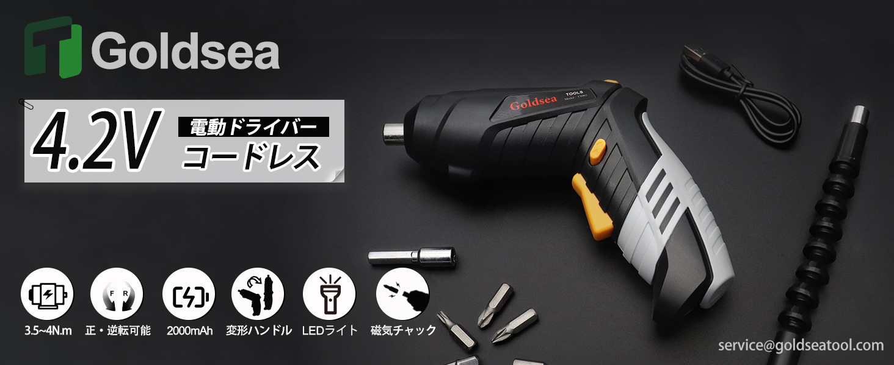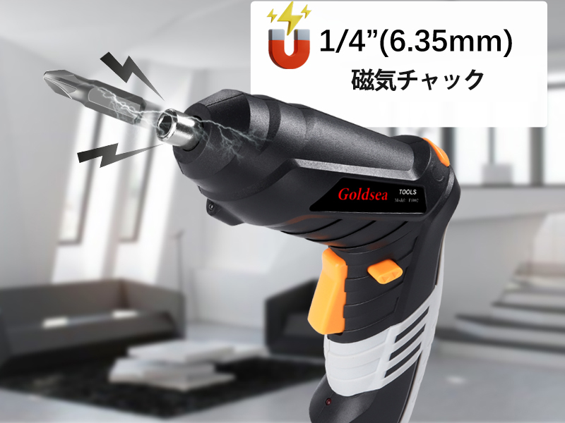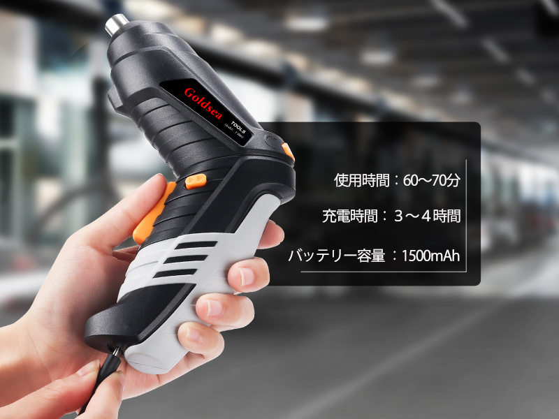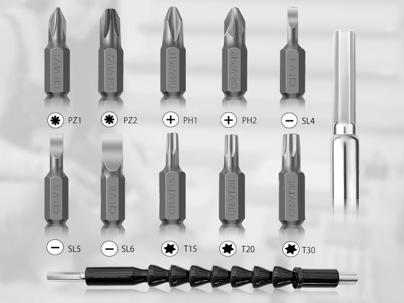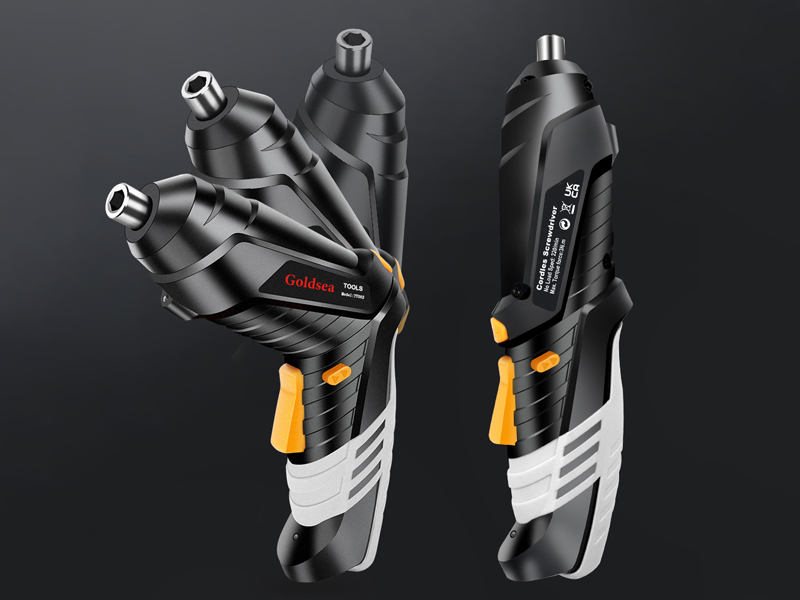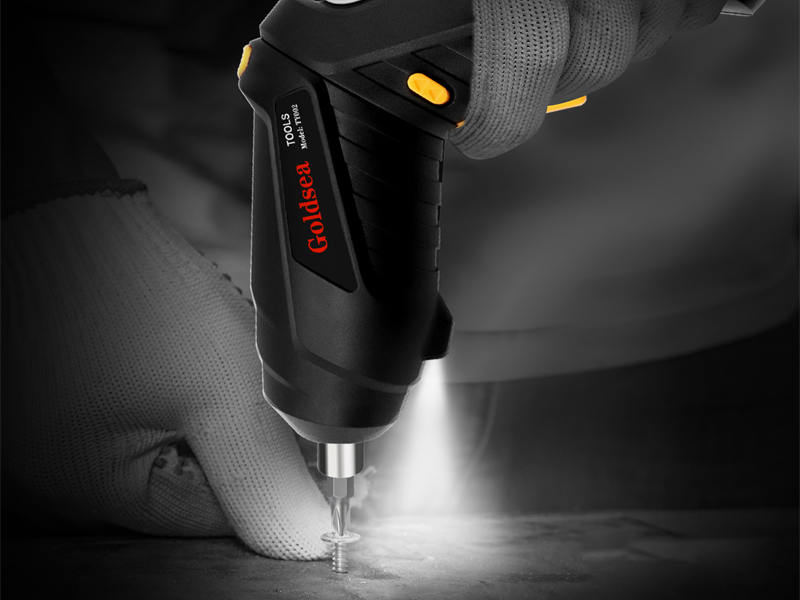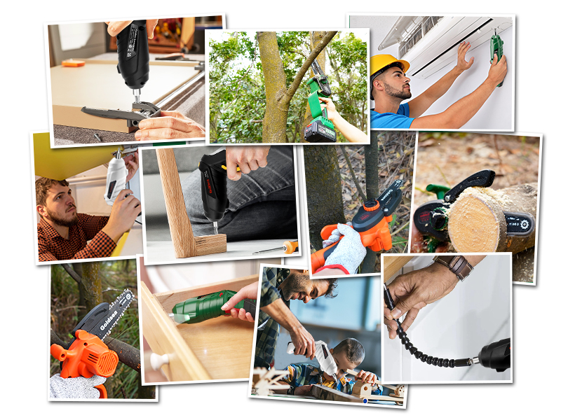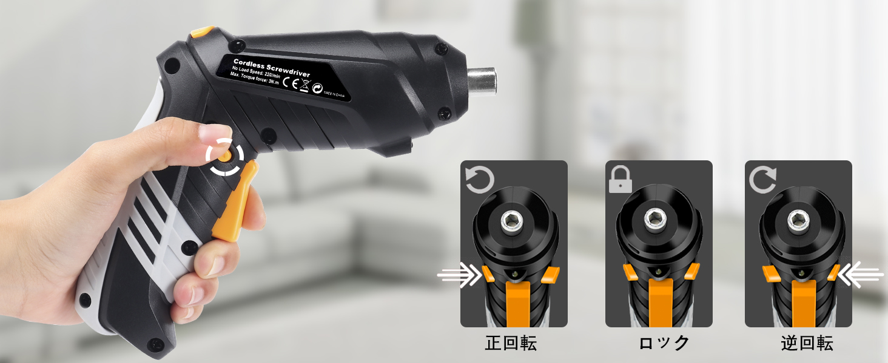
</section>
