---
hide:
  - toc
---

<label for="site-language">Language</label><select id="site-language" data-language-select><option value="en">English</option><option value="ja">日本語</option><option value="de">Deutsch</option><option value="it">Italiano</option></select>

<h2 data-i18n="productGallery">Product Gallery</h2>
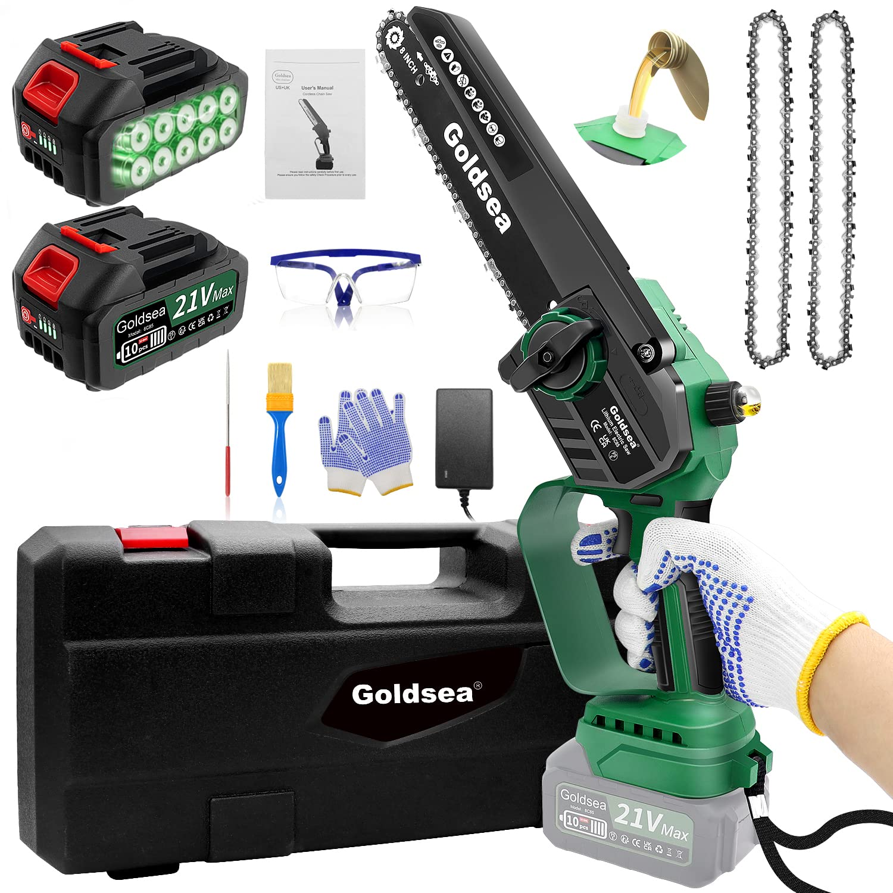

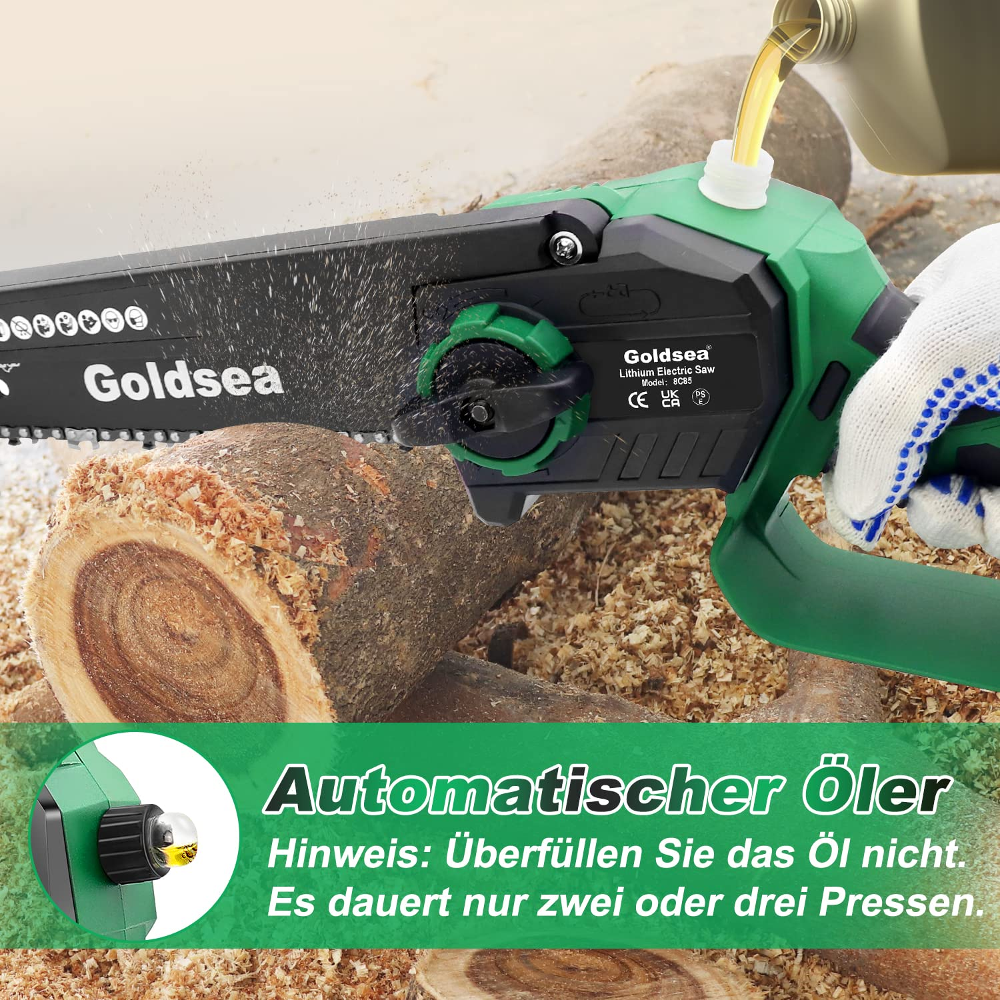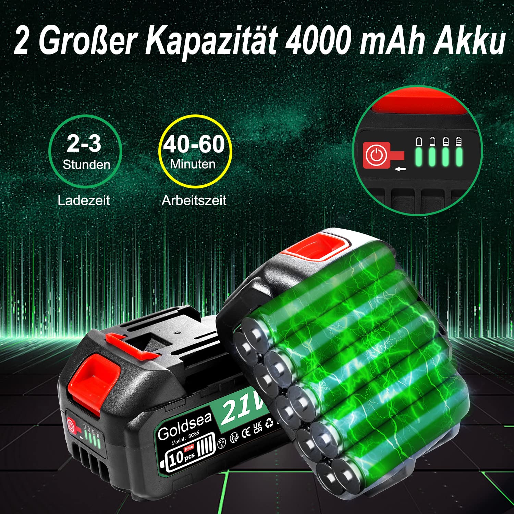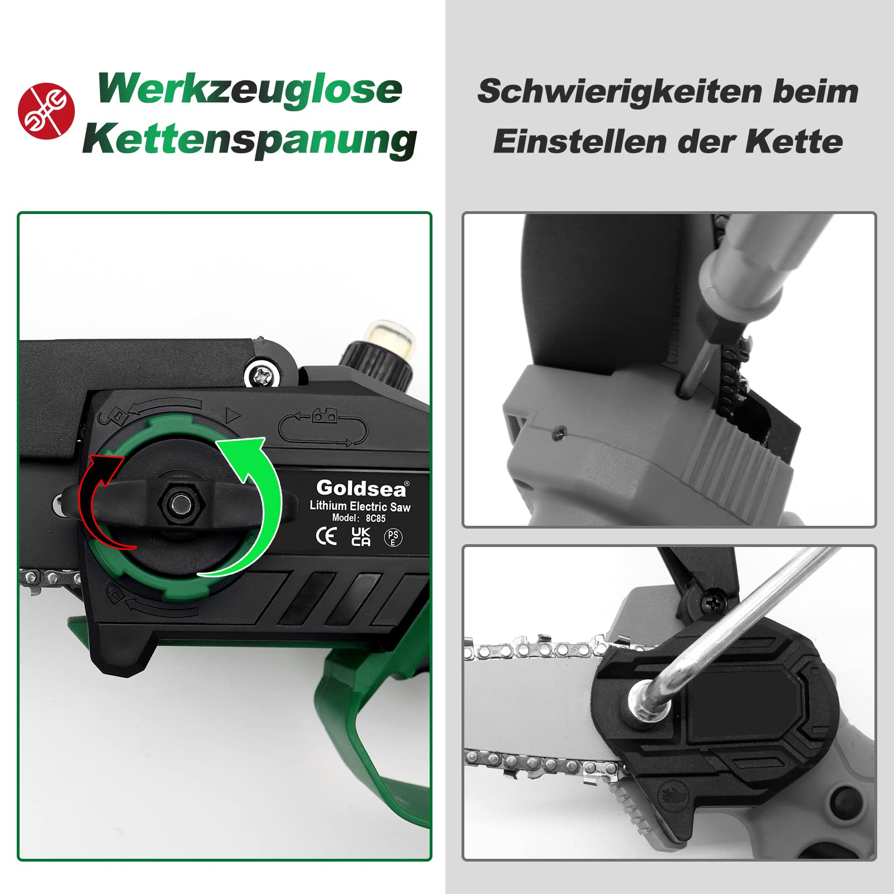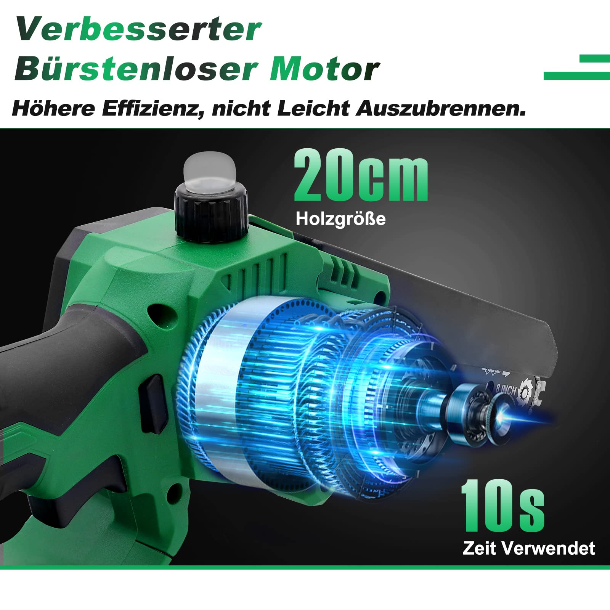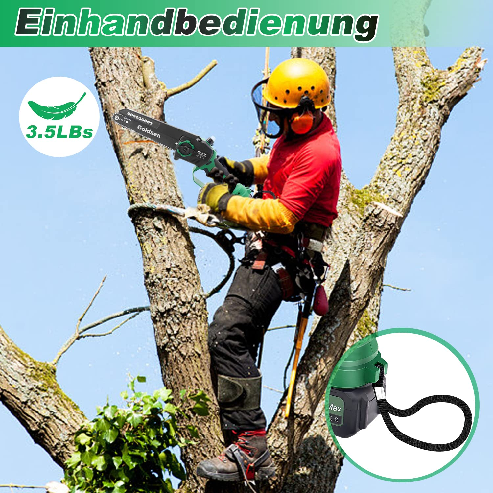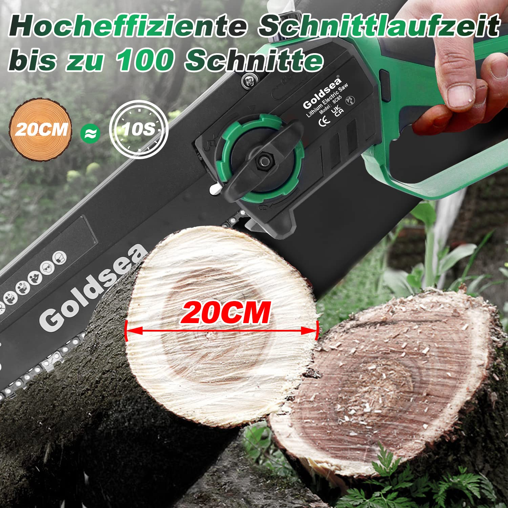

Home / Mini Chainsaws / B0BBLMBYP8

Price shown on Amazon

ASIN: B0BBLMBYP8
<a class="amazon-buy" href="https://www.amazon.com/dp/B0BBLMBYP8" target="_blank" rel="nofollow noopener" data-i18n="viewAmazon">View on Amazon</a><a class="amazon-secondary" href="../" data-i18n="backCatalog">Back to catalog</a>

<section data-lang-content="en">
<h1>Goldsea 6 Inch Mini Chainsaw with 4000 mAh Battery</h1>

Battery-powered 6 inch mini chainsaw with automatic oiler, brushless 800W motor, two 2000 mAh batteries and safety protection for garden cutting, pruning and firewood work.

<h2>Product Features</h2><ul><li>90% longer service life than traditional models, ideal for regular garden use.</li><li>800W brushless motor and chain speed up to 7 m/s cut 15 cm wood in about 10 seconds.</li><li>Two 2000 mAh batteries support 50-60 minutes of continuous cutting.</li><li>Automatic chain lubrication keeps the chain running smoothly and reduces maintenance.</li><li>Double safety lock and chain guard improve stability and reduce accident risk.</li><li>Quiet operation is suitable for home gardens, camping and daily yard work.</li></ul>
<h2>Specifications</h2><table><tr><th>Power source</th><td>Battery powered</td></tr><tr><th>Motor</th><td>800W brushless</td></tr><tr><th>Battery</th><td>2 × 2000 mAh</td></tr><tr><th>Cutting bar</th><td>6 inch</td></tr><tr><th>Dimensions</th><td>39 × 20 × 15 cm</td></tr><tr><th>Weight</th><td>1.84 kg</td></tr><tr><th>Included</th><td>Chainsaw, 2 batteries, charger, 2 chains, file, gloves, glasses, brush, manual</td></tr></table>
<h2>Selling Point Analysis</h2><ul><li>Goldsea 6 Inch Mini Chainsaw with 4000 mAh Battery has a clear use case in Mini Chainsaws, so buyers can quickly understand what problem it solves.</li><li>The screenshot text is converted into readable product copy instead of staying only inside images.</li><li>Product images are separated from A+ detail images to match an Amazon-style detail page.</li><li>The feature list highlights runtime, accessories, safety, operation and maintenance benefits where relevant.</li><li>The page supports multilingual visitors while keeping the Amazon purchase path clear.</li></ul>
<h2>Q&A</h2>

What is this product best used for?

Goldsea 6 Inch Mini Chainsaw with 4000 mAh Battery is best used for mini chainsaws tasks described in the uploaded product screenshots.

Where can I buy it?

Use the Amazon button to open ASIN B0BBLMBYP8.

Does the page use uploaded images?

Yes. The main gallery uses product-images and the A+ section uses A+-images.

Is live pricing shown here?

No. Amazon price and availability should be checked on Amazon.

What are the main selling points?

The key advantages are practical functionality, clear accessory bundle, easy operation and a direct purchase path.

Can more details be added later?

Yes. Additional screenshots or text files can be added to the ASIN folder and regenerated.

</section>
<section data-lang-content="ja" hidden>
<h1>Goldsea 6 Inch ミニチェーンソー with 4000 mAh バッテリー</h1>

スクリーンショットの商品情報を基に整理した説明です。バッテリー-powered 6 inch mini chainsaw with automatic oiler, brushless 800W motor, two 2000 mAh batteries and safety protection for 庭木 切断, 剪定 and firewood work.

<h2>商品の特徴</h2><ul><li>90% longer service life than traditional models, ideal for regular 庭木 use.</li><li>800W ブラシレスモーター and chain speed up to 7 m/s cut 15 cm wood in about 10 seconds.</li><li>Two 2000 mAh batteries support 50-60 minutes of continuous 切断.</li><li>Automatic chain lubrication keeps the chain running smoothly and reduces maintenance.</li><li>Double safety lock and chain guard improve stability and reduce accident risk.</li><li>Quiet operation is suitable for home 庭木s, camping and daily yard work.</li></ul>
<h2>仕様</h2><table><tr><th>Power source</th><td>バッテリー powered</td></tr><tr><th>Motor</th><td>800W brushless</td></tr><tr><th>バッテリー</th><td>2 × 2000 mAh</td></tr><tr><th>Cutting bar</th><td>6 inch</td></tr><tr><th>Dimensions</th><td>39 × 20 × 15 cm</td></tr><tr><th>Weight</th><td>1.84 kg</td></tr><tr><th>Included</th><td>Chainsaw, 2 batteries, charger, 2 chains, file, gloves, glasses, brush, manual</td></tr></table>
<h2>セールスポイント分析</h2><ul><li>Goldsea 6 Inch ミニチェーンソー with 4000 mAh バッテリー has a clear use case in ミニチェーンソーs, so buyers can quickly understand what problem it solves.</li><li>The screenshot text is converted into readable product copy instead of staying only inside images.</li><li>商品 images are separated from A+ detail images to match an Amazon-style detail page.</li><li>The feature list highlights runtime, accessories, safety, operation and maintenance benefits where relevant.</li><li>The page supports multilingual visitors while keeping the Amazon purchase path clear.</li></ul>
<h2>よくある質問</h2>

この商品は何に適していますか？

Goldsea 6 Inch ミニチェーンソー with 4000 mAh バッテリー is best used for mini chainsaws tasks described in the uploaded product screenshots.

どこで購入できますか？

Use the Amazon button to open ASIN B0BBLMBYP8.

このページはアップロード画像を使用していますか？

Yes. The main gallery uses product-images and the A+ section uses A+-images.

ここにリアルタイム価格は表示されますか？

No. Amazon price and availability should be checked on Amazon.

主なセールスポイントは何ですか？

The key advantages are practical functionality, clear accessory bundle, easy operation and a direct purchase path.

後から詳細を追加できますか？

Yes. Additional screenshots or text files can be added to the ASIN folder and regenerated.

</section>
<section data-lang-content="de" hidden>
<h1>Goldsea 6 Inch Mini-Kettensäge with 4000 mAh Akku</h1>

Aus den hochgeladenen Produkt-Screenshots aufbereitete Beschreibung: Akku-powered 6 inch mini chainsaw with automatic oiler, brushless 800W motor, two 2000 mAh batteries and safety protection for Garten Schneiden, Beschneiden and firewood work.

<h2>Produktmerkmale</h2><ul><li>90% longer service life than traditional models, ideal for regular Garten use.</li><li>800W bürstenlosem Motor and chain speed up to 7 m/s cut 15 cm wood in about 10 seconds.</li><li>Two 2000 mAh batteries support 50-60 minutes of continuous Schneiden.</li><li>Automatic chain lubrication keeps the chain running smoothly and reduces maintenance.</li><li>Double safety lock and chain guard improve stability and reduce accident risk.</li><li>Quiet operation is suitable for home Gartens, camping and daily yard work.</li></ul>
<h2>Spezifikationen</h2><table><tr><th>Power source</th><td>Akku powered</td></tr><tr><th>Motor</th><td>800W brushless</td></tr><tr><th>Akku</th><td>2 × 2000 mAh</td></tr><tr><th>Cutting bar</th><td>6 inch</td></tr><tr><th>Dimensions</th><td>39 × 20 × 15 cm</td></tr><tr><th>Weight</th><td>1.84 kg</td></tr><tr><th>Included</th><td>Chainsaw, 2 batteries, charger, 2 chains, file, gloves, glasses, brush, manual</td></tr></table>
<h2>Verkaufsargumente</h2><ul><li>Goldsea 6 Inch Mini-Kettensäge with 4000 mAh Akku has a clear use case in Mini-Kettensäges, so buyers can quickly understand what problem it solves.</li><li>The screenshot text is converted into readable product copy instead of staying only inside images.</li><li>Product images are separated from A+ detail images to match an Amazon-style detail page.</li><li>The feature list highlights runtime, accessories, safety, operation and maintenance benefits where relevant.</li><li>The page supports multilingual visitors while keeping the Amazon purchase path clear.</li></ul>
<h2>Fragen und Antworten</h2>

Wofür eignet sich dieses Produkt am besten?

Goldsea 6 Inch Mini-Kettensäge with 4000 mAh Akku is best used for mini chainsaws tasks described in the uploaded product screenshots.

Wo kann ich es kaufen?

Use the Amazon button to open ASIN B0BBLMBYP8.

Verwendet die Seite hochgeladene Bilder?

Yes. The main gallery uses product-images and the A+ section uses A+-images.

Wird hier der Live-Preis angezeigt?

No. Amazon price and availability should be checked on Amazon.

Was sind die wichtigsten Verkaufsargumente?

The key advantages are practical functionality, clear accessory bundle, easy operation and a direct purchase path.

Können später weitere Details hinzugefügt werden?

Yes. Additional screenshots or text files can be added to the ASIN folder and regenerated.

</section>
<section data-lang-content="it" hidden>
<h1>Goldsea 6 Inch mini motosega with 4000 mAh batteria</h1>

Descrizione rielaborata dagli screenshot del prodotto caricati: batteria-powered 6 inch mini chainsaw with automatic oiler, brushless 800W motor, two 2000 mAh batteries and safety protection for giardino taglio, potatura and firewood work.

<h2>Caratteristiche del prodotto</h2><ul><li>90% longer service life than traditional models, ideal for regular giardino use.</li><li>800W motore brushless and chain speed up to 7 m/s cut 15 cm wood in about 10 seconds.</li><li>Two 2000 mAh batteries support 50-60 minutes of continuous taglio.</li><li>Automatic chain lubrication keeps the chain running smoothly and reduces maintenance.</li><li>Double safety lock and chain guard improve stability and reduce accident risk.</li><li>Quiet operation is suitable for home giardinos, camping and daily yard work.</li></ul>
<h2>Specifiche</h2><table><tr><th>Power source</th><td>batteria powered</td></tr><tr><th>Motor</th><td>800W brushless</td></tr><tr><th>batteria</th><td>2 × 2000 mAh</td></tr><tr><th>Cutting bar</th><td>6 inch</td></tr><tr><th>Dimensions</th><td>39 × 20 × 15 cm</td></tr><tr><th>Weight</th><td>1.84 kg</td></tr><tr><th>Included</th><td>Chainsaw, 2 batteries, charger, 2 chains, file, gloves, glasses, brush, manual</td></tr></table>
<h2>Analisi dei punti di forza</h2><ul><li>Goldsea 6 Inch mini motosega with 4000 mAh batteria has a clear use case in mini motosegas, so buyers can quickly understand what problem it solves.</li><li>The screenshot text is converted into readable product copy instead of staying only inside images.</li><li>Product images are separated from A+ detail images to match an Amazon-style detail page.</li><li>The feature list highlights runtime, accessories, safety, operation and maintenance benefits where relevant.</li><li>The page supports multilingual visitors while keeping the Amazon purchase path clear.</li></ul>
<h2>Domande e risposte</h2>

Per cosa è più adatto questo prodotto?

Goldsea 6 Inch mini motosega with 4000 mAh batteria is best used for mini chainsaws tasks described in the uploaded product screenshots.

Dove posso acquistarlo?

Use the Amazon button to open ASIN B0BBLMBYP8.

La pagina usa immagini caricate?

Yes. The main gallery uses product-images and the A+ section uses A+-images.

Il prezzo in tempo reale è mostrato qui?

No. Amazon price and availability should be checked on Amazon.

Quali sono i principali punti di forza?

The key advantages are practical functionality, clear accessory bundle, easy operation and a direct purchase path.

Si possono aggiungere altri dettagli in seguito?

Yes. Additional screenshots or text files can be added to the ASIN folder and regenerated.

</section>

<section class="aplus-section"><h2 data-i18n="aplusImages">A+ Detail Images</h2>
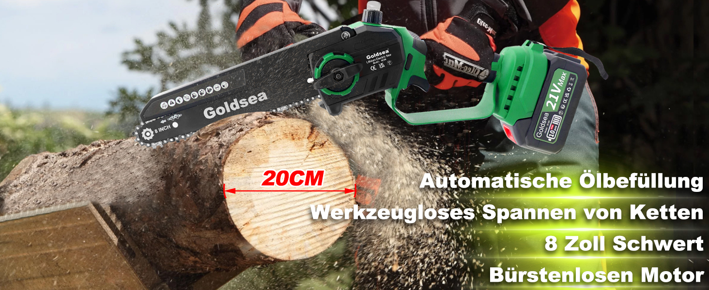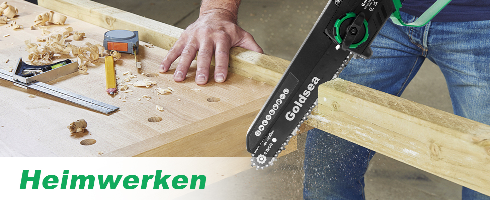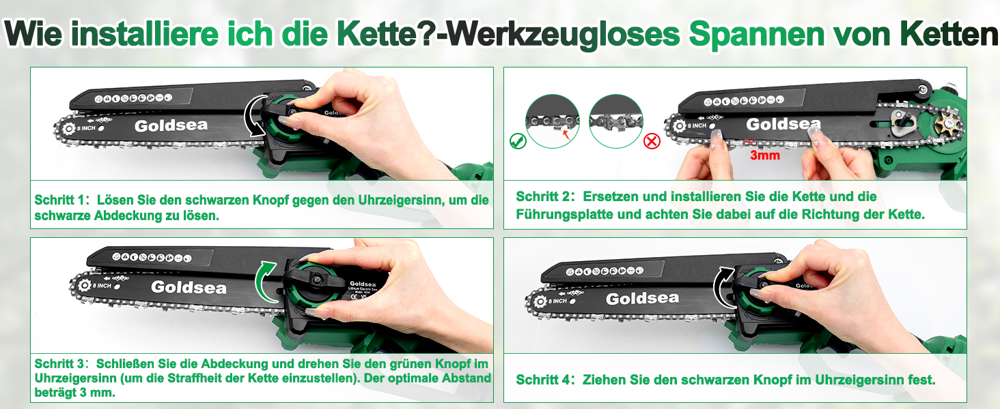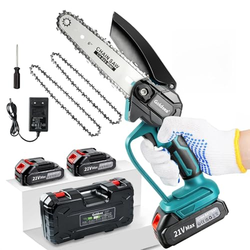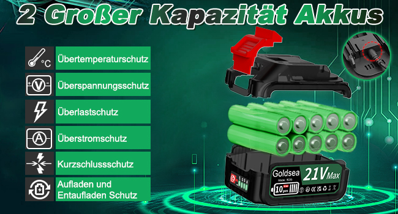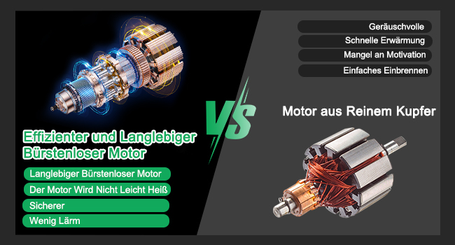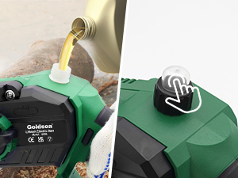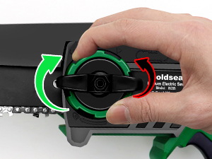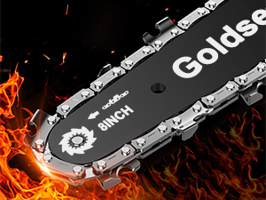
</section>
