---
hide:
  - toc
---

<label for="site-language">Language</label><select id="site-language" data-language-select><option value="en">English</option><option value="ja">日本語</option><option value="de">Deutsch</option><option value="it">Italiano</option></select>

<h2 data-i18n="productGallery">Product Gallery</h2>
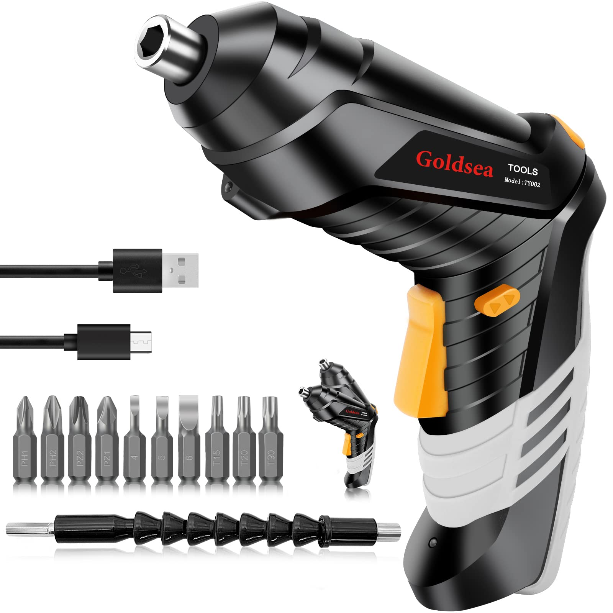

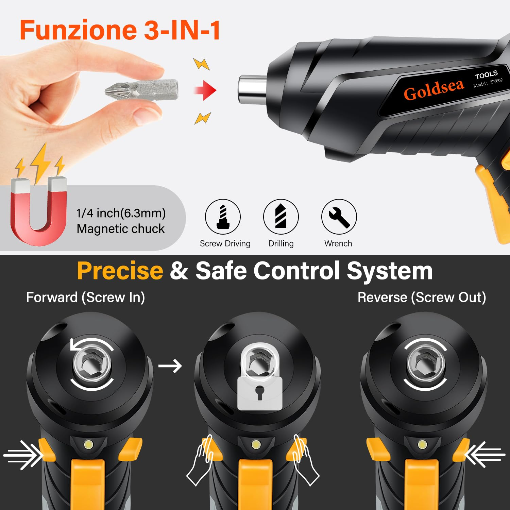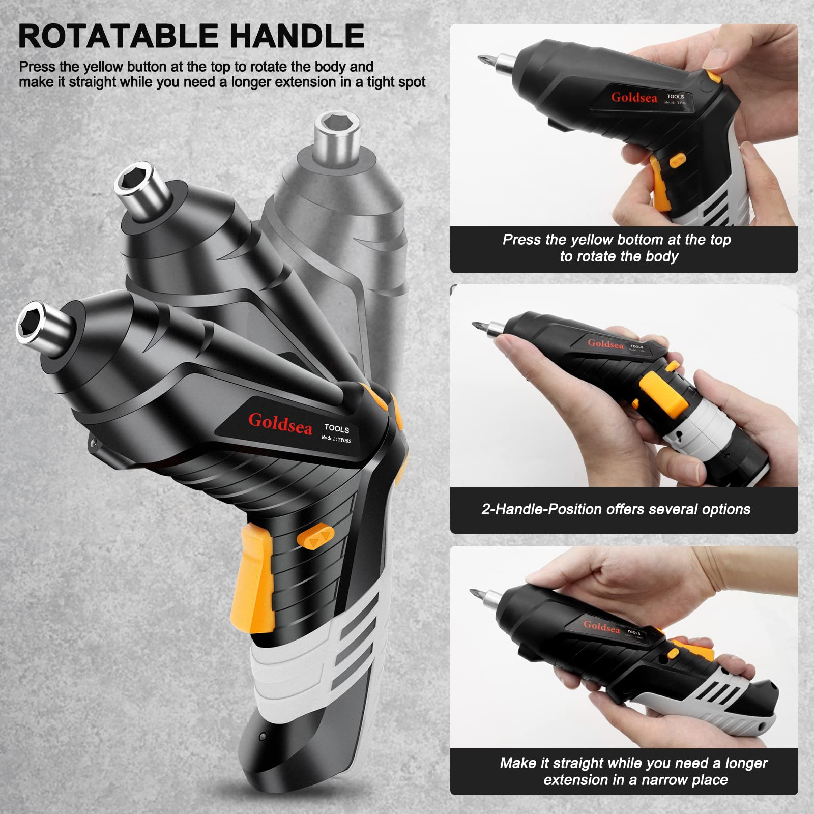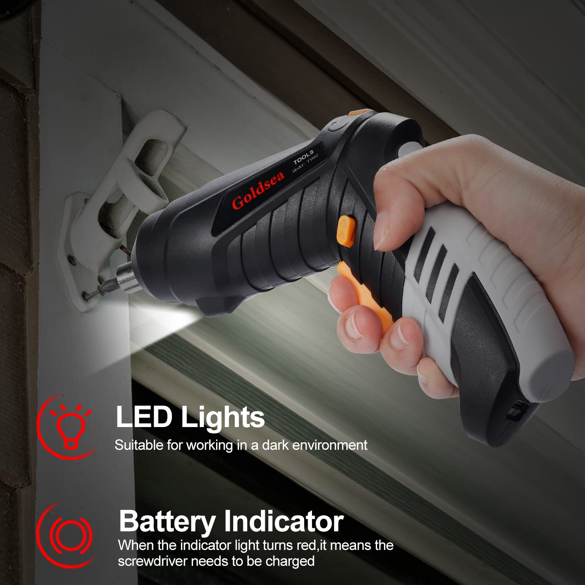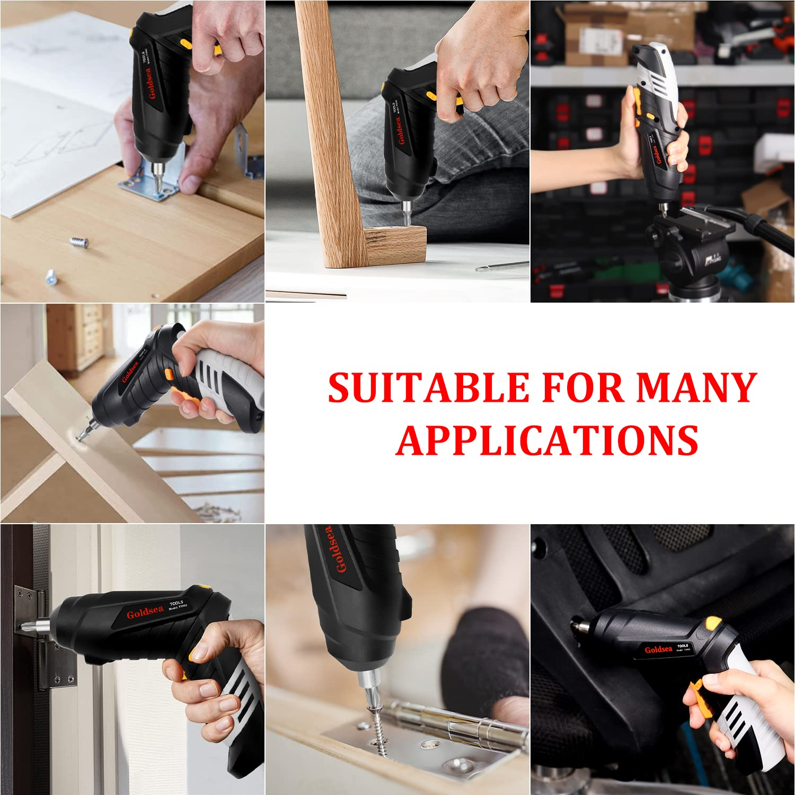

Home / Cordless Screwdrivers / B0BBVG9ZLN

Price shown on Amazon

ASIN: B0BBVG9ZLN
<a class="amazon-buy" href="https://www.amazon.com/dp/B0BBVG9ZLN" target="_blank" rel="nofollow noopener" data-i18n="viewAmazon">View on Amazon</a><a class="amazon-secondary" href="../" data-i18n="backCatalog">Back to catalog</a>

<section class="product-copy" data-product-copy>
<h1 data-product-title>Goldsea 4.2V Adjustable Electric Screwdriver</h1>

Rechargeable 4.2V electric screwdriver with adjustable 90°-180° handle, LED light, Type-C charging, 3.5 N.m torque and accessory kit for household DIY and repairs.

<h2 data-product-features-title>Product Features</h2><ul data-product-features><li>Magnetic chuck enables quick and easy screwdriver bit replacement.</li><li>Includes 10 CRV bits for common installation and disassembly tasks.</li><li>Lightweight 0.3 kg body and ergonomic rubber grip are comfortable for long sessions.</li><li>Adjustable handle switches between pistol and straight form for blind corners or narrow spaces.</li><li>Forward/reverse button changes rotation direction for tightening or loosening screws.</li><li>Front LED work light improves visibility in dark or late-night work areas.</li><li>Type-C cable allows quick charging from power banks or computer USB ports.</li></ul>
<h2 data-product-specs-title>Specifications</h2><table data-product-specs><tr><th>Brand</th><td>Goldsea</td></tr><tr><th>Material</th><td>Rubber</td></tr><tr><th>Speed</th><td>220 rpm</td></tr><tr><th>Power source</th><td>Battery powered</td></tr><tr><th>Voltage</th><td>4.2V DC</td></tr><tr><th>Torque</th><td>3 N.m</td></tr><tr><th>Dimensions</th><td>23 × 6 × 17 cm</td></tr></table>
<h2 data-product-analysis-title>Selling Point Analysis</h2><ul data-product-analysis><li>Goldsea 4.2V Adjustable Electric Screwdriver has a clear use case in Cordless Screwdrivers, so buyers can quickly understand what problem it solves.</li><li>The screenshot text is converted into readable product copy instead of staying only inside images.</li><li>Product images are separated from A+ detail images to match an Amazon-style detail page.</li><li>The feature list highlights runtime, accessories, safety, operation and maintenance benefits where relevant.</li><li>The page supports multilingual visitors while keeping the Amazon purchase path clear.</li></ul>
<h2 data-product-qa-title>Q&A</h2>

What is this product best used for?

Goldsea 4.2V Adjustable Electric Screwdriver is best used for cordless screwdrivers tasks described in the uploaded product screenshots.

Where can I buy it?

Use the Amazon button to open ASIN B0BBVG9ZLN.

Does the page use uploaded images?

Yes. The main gallery uses product-images and the A+ section uses A+-images.

Is live pricing shown here?

No. Amazon price and availability should be checked on Amazon.

What are the main selling points?

The key advantages are practical functionality, clear accessory bundle, easy operation and a direct purchase path.

Can more details be added later?

Yes. Additional screenshots or text files can be added to the ASIN folder and regenerated.

</section>

<section class="aplus-section"><h2 data-i18n="aplusImages">A+ Detail Images</h2>
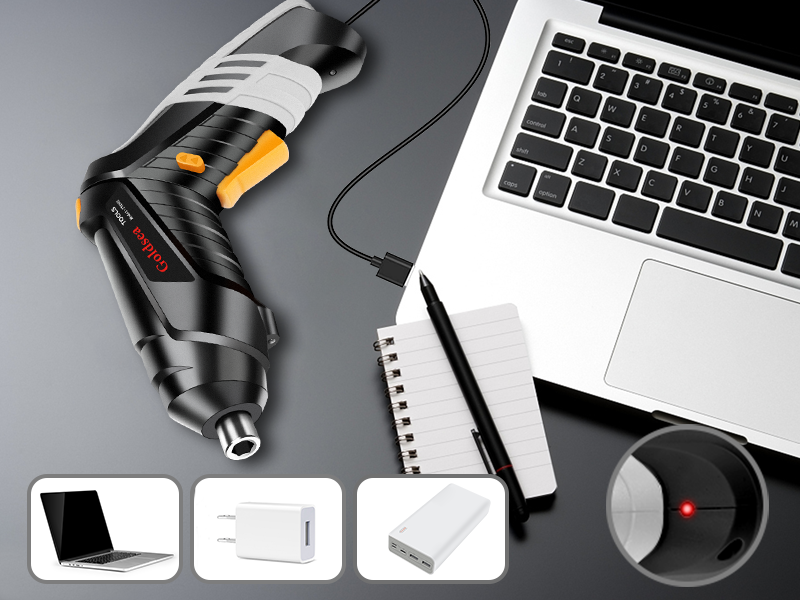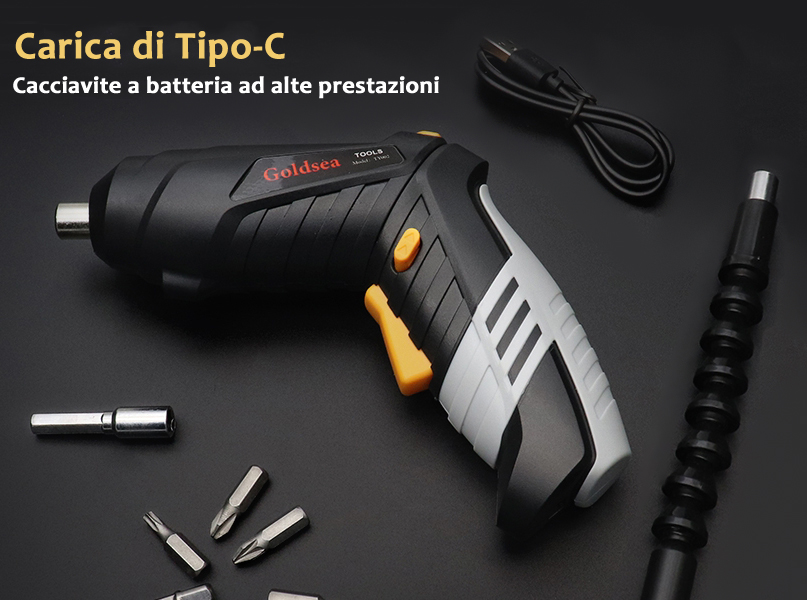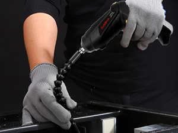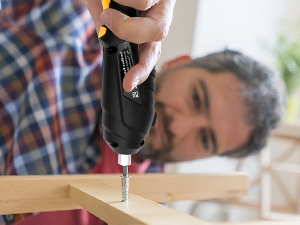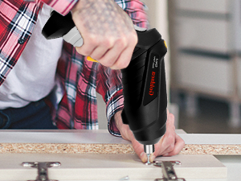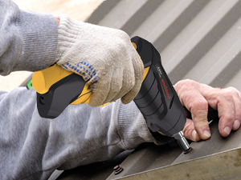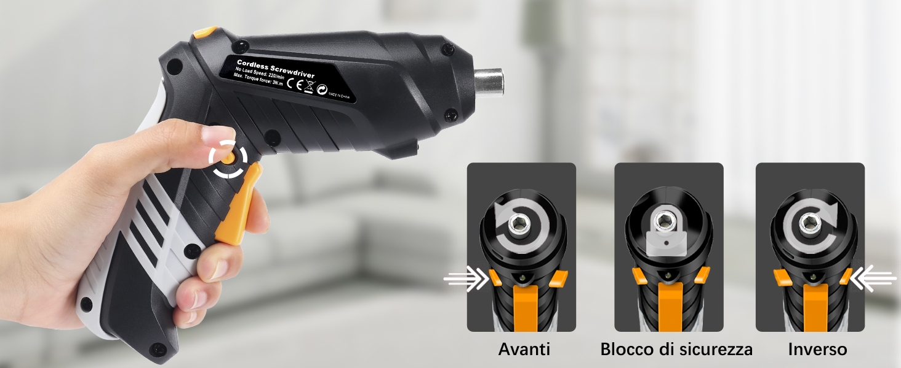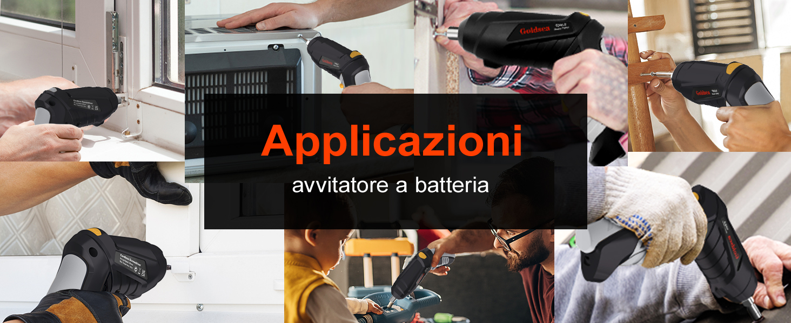
</section>

