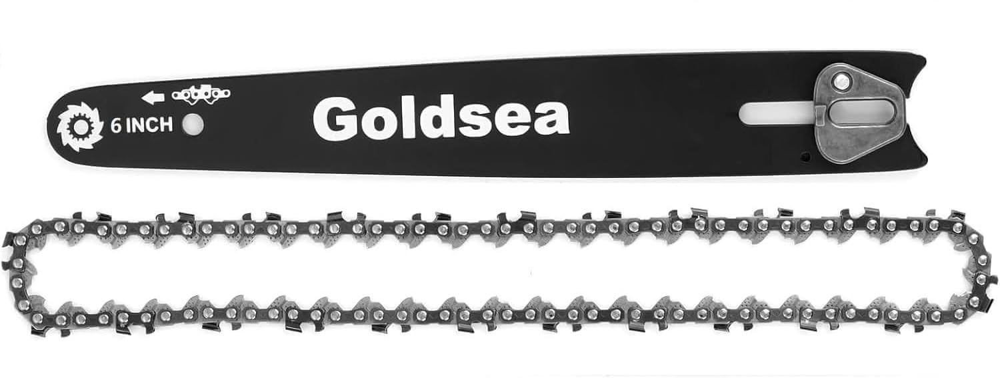
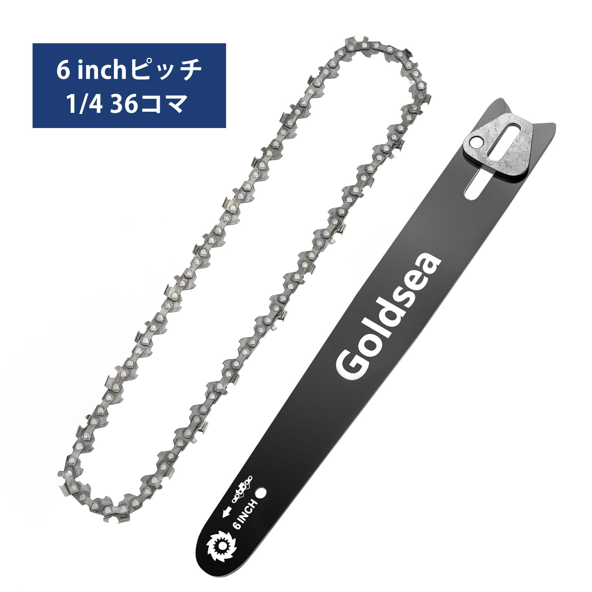
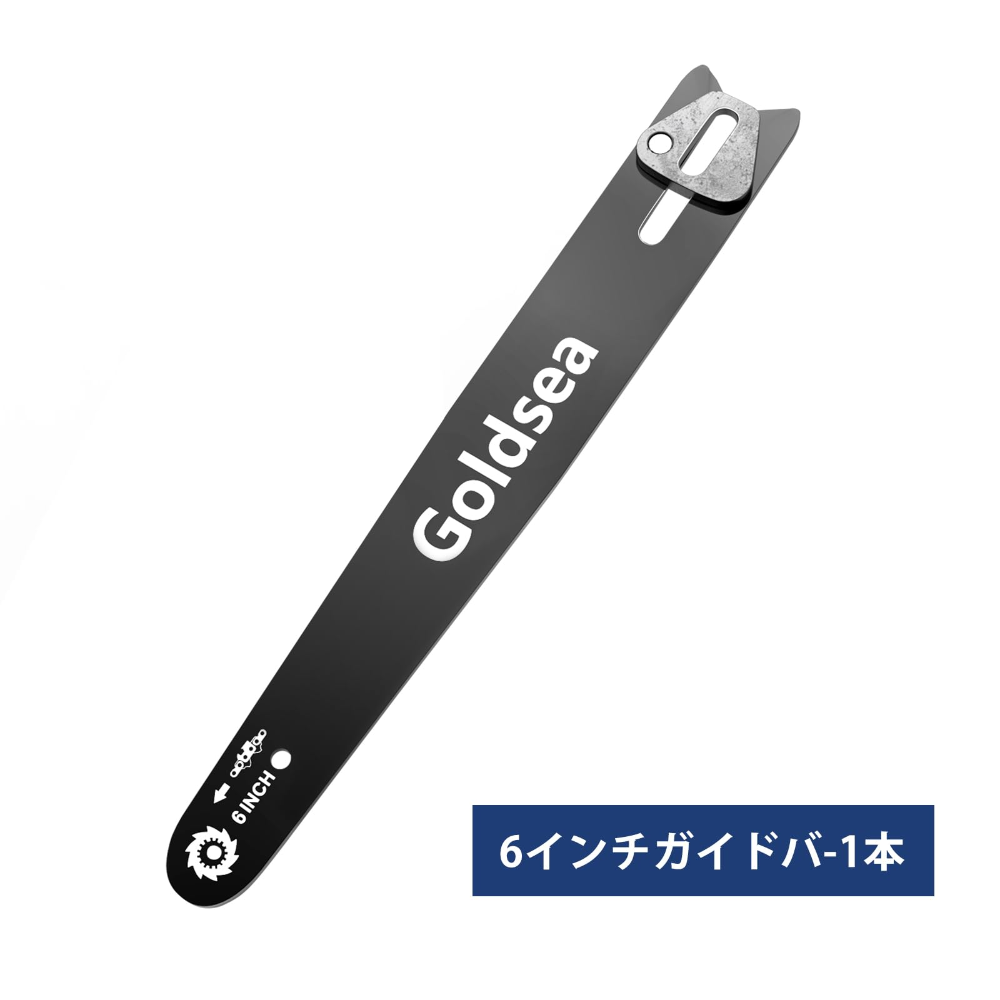
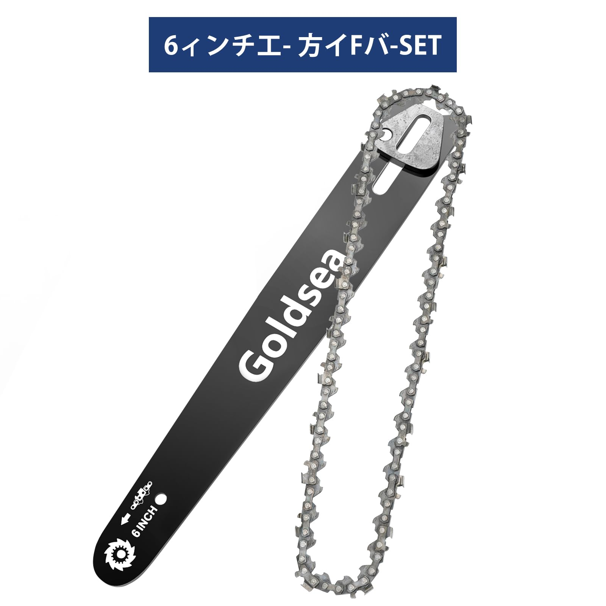

---
hide:
  - toc
---

<label for="site-language">Language</label><select id="site-language" data-language-select><option value="en">English</option><option value="ja">日本語</option><option value="de">Deutsch</option><option value="it">Italiano</option></select>

<h2 data-i18n="productGallery">Product Gallery</h2>

Home / Chainsaw Parts / B0BCWDF3KB

Price shown on Amazon

ASIN: B0BCWDF3KB
<a class="amazon-buy" href="https://www.amazon.com/dp/B0BCWDF3KB" target="_blank" rel="nofollow noopener" data-i18n="viewAmazon">View on Amazon</a><a class="amazon-secondary" href="../" data-i18n="backCatalog">Back to catalog</a>

<section data-lang-content="en" style="display:block">
<h1>Goldsea Chainsaw Guide Plate and Saw Chain Set</h1>

Replacement guide plate and saw chain set for Goldsea 6 inch chainsaws, designed for stable cutting performance and routine maintenance.

<h2>Product Features</h2><ul><li>Replacement guide plate and saw chain for Goldsea 6 inch chainsaw models.</li><li>36-link 1/4 pitch chain format supports compact cutting systems.</li><li>Suitable for maintenance, repair and restoring cutting performance.</li><li>Lightweight 0.05 kg part is easy to store and carry with the tool kit.</li><li>Designed for DIY, garden and cordless chainsaw users who need spare chains.</li></ul>
<h2>Specifications</h2><table><tr><th>Brand</th><td>Goldsea</td></tr><tr><th>Power source</th><td>Battery powered</td></tr><tr><th>Power</th><td>600W</td></tr><tr><th>Weight</th><td>0.05 kg</td></tr><tr><th>Dimensions</th><td>22 × 15 × 2 cm</td></tr><tr><th>Part number</th><td>Part2603</td></tr><tr><th>ASIN</th><td>B0BCWDF3KB</td></tr></table>
<h2>Selling Point Analysis</h2><ul><li>Goldsea Chainsaw Guide Plate and Saw Chain Set has a clear use case in Chainsaw Parts, so buyers can quickly understand what problem it solves.</li><li>The screenshot text is converted into readable product copy instead of staying only inside images.</li><li>Product images are separated from A+ detail images to match an Amazon-style detail page.</li><li>The feature list highlights runtime, accessories, safety, operation and maintenance benefits where relevant.</li><li>The page supports multilingual visitors while keeping the Amazon purchase path clear.</li></ul>
<h2>Q&A</h2>

What is this product best used for?

Goldsea Chainsaw Guide Plate and Saw Chain Set is best used for chainsaw parts tasks described in the uploaded product screenshots.

Where can I buy it?

Use the Amazon button to open ASIN B0BCWDF3KB.

Does the page use uploaded images?

Yes. The main gallery uses product-images and the A+ section uses A+-images.

Is live pricing shown here?

No. Amazon price and availability should be checked on Amazon.

What are the main selling points?

The key advantages are practical functionality, clear accessory bundle, easy operation and a direct purchase path.

Can more details be added later?

Yes. Additional screenshots or text files can be added to the ASIN folder and regenerated.

</section>
<section data-lang-content="ja" style="display:none">
<h1>Goldsea Chainsaw Guide Plate and Saw Chain Set</h1>

スクリーンショットの商品情報を基に整理した説明です。Replacement guide plate and saw chain set for Goldsea 6 inch chainsaws, designed for stable 切断 performance and routine maintenance.

<h2>商品の特徴</h2><ul><li>Replacement guide plate and saw chain for Goldsea 6 inch chainsaw models.</li><li>36-link 1/4 pitch chain format supports compact 切断 systems.</li><li>Suitable for maintenance, repair and restoring 切断 performance.</li><li>Lightweight 0.05 kg part is easy to store and carry with the tool kit.</li><li>Designed for DIY, 庭木 and コードレス chainsaw users who need spare chains.</li></ul>
<h2>仕様</h2><table><tr><th>Brand</th><td>Goldsea</td></tr><tr><th>Power source</th><td>バッテリー powered</td></tr><tr><th>Power</th><td>600W</td></tr><tr><th>Weight</th><td>0.05 kg</td></tr><tr><th>Dimensions</th><td>22 × 15 × 2 cm</td></tr><tr><th>Part number</th><td>Part2603</td></tr><tr><th>ASIN</th><td>B0BCWDF3KB</td></tr></table>
<h2>セールスポイント分析</h2><ul><li>Goldsea Chainsaw Guide Plate and Saw Chain Set has a clear use case in Chainsaw Parts, so buyers can quickly understand what problem it solves.</li><li>The screenshot text is converted into readable product copy instead of staying only inside images.</li><li>商品 images are separated from A+ detail images to match an Amazon-style detail page.</li><li>The feature list highlights runtime, accessories, safety, operation and maintenance benefits where relevant.</li><li>The page supports multilingual visitors while keeping the Amazon purchase path clear.</li></ul>
<h2>よくある質問</h2>

この商品は何に適していますか？

Goldsea Chainsaw Guide Plate and Saw Chain Set is best used for chainsaw parts tasks described in the uploaded product screenshots.

どこで購入できますか？

Use the Amazon button to open ASIN B0BCWDF3KB.

このページはアップロード画像を使用していますか？

Yes. The main gallery uses product-images and the A+ section uses A+-images.

ここにリアルタイム価格は表示されますか？

No. Amazon price and availability should be checked on Amazon.

主なセールスポイントは何ですか？

The key advantages are practical functionality, clear accessory bundle, easy operation and a direct purchase path.

後から詳細を追加できますか？

Yes. Additional screenshots or text files can be added to the ASIN folder and regenerated.

</section>
<section data-lang-content="de" style="display:none">
<h1>Goldsea Chainsaw Guide Plate and Saw Chain Set</h1>

Aus den hochgeladenen Produkt-Screenshots aufbereitete Beschreibung: Replacement guide plate and saw chain set for Goldsea 6 inch chainsaws, designed for stable Schneiden performance and routine maintenance.

<h2>Produktmerkmale</h2><ul><li>Replacement guide plate and saw chain for Goldsea 6 inch chainsaw models.</li><li>36-link 1/4 pitch chain format supports compact Schneiden systems.</li><li>Suitable for maintenance, repair and restoring Schneiden performance.</li><li>Lightweight 0.05 kg part is easy to store and carry with the tool kit.</li><li>Designed for DIY, Garten and kabelloser chainsaw users who need spare chains.</li></ul>
<h2>Spezifikationen</h2><table><tr><th>Brand</th><td>Goldsea</td></tr><tr><th>Power source</th><td>Akku powered</td></tr><tr><th>Power</th><td>600W</td></tr><tr><th>Weight</th><td>0.05 kg</td></tr><tr><th>Dimensions</th><td>22 × 15 × 2 cm</td></tr><tr><th>Part number</th><td>Part2603</td></tr><tr><th>ASIN</th><td>B0BCWDF3KB</td></tr></table>
<h2>Verkaufsargumente</h2><ul><li>Goldsea Chainsaw Guide Plate and Saw Chain Set has a clear use case in Chainsaw Parts, so buyers can quickly understand what problem it solves.</li><li>The screenshot text is converted into readable product copy instead of staying only inside images.</li><li>Product images are separated from A+ detail images to match an Amazon-style detail page.</li><li>The feature list highlights runtime, accessories, safety, operation and maintenance benefits where relevant.</li><li>The page supports multilingual visitors while keeping the Amazon purchase path clear.</li></ul>
<h2>Fragen und Antworten</h2>

Wofür eignet sich dieses Produkt am besten?

Goldsea Chainsaw Guide Plate and Saw Chain Set is best used for chainsaw parts tasks described in the uploaded product screenshots.

Wo kann ich es kaufen?

Use the Amazon button to open ASIN B0BCWDF3KB.

Verwendet die Seite hochgeladene Bilder?

Yes. The main gallery uses product-images and the A+ section uses A+-images.

Wird hier der Live-Preis angezeigt?

No. Amazon price and availability should be checked on Amazon.

Was sind die wichtigsten Verkaufsargumente?

The key advantages are practical functionality, clear accessory bundle, easy operation and a direct purchase path.

Können später weitere Details hinzugefügt werden?

Yes. Additional screenshots or text files can be added to the ASIN folder and regenerated.

</section>
<section data-lang-content="it" style="display:none">
<h1>Goldsea Chainsaw Guide Plate and Saw Chain Set</h1>

Descrizione rielaborata dagli screenshot del prodotto caricati: Replacement guide plate and saw chain set for Goldsea 6 inch chainsaws, designed for stable taglio performance and routine maintenance.

<h2>Caratteristiche del prodotto</h2><ul><li>Replacement guide plate and saw chain for Goldsea 6 inch chainsaw models.</li><li>36-link 1/4 pitch chain format supports compact taglio systems.</li><li>Suitable for maintenance, repair and restoring taglio performance.</li><li>Lightweight 0.05 kg part is easy to store and carry with the tool kit.</li><li>Designed for DIY, giardino and senza fili chainsaw users who need spare chains.</li></ul>
<h2>Specifiche</h2><table><tr><th>Brand</th><td>Goldsea</td></tr><tr><th>Power source</th><td>batteria powered</td></tr><tr><th>Power</th><td>600W</td></tr><tr><th>Weight</th><td>0.05 kg</td></tr><tr><th>Dimensions</th><td>22 × 15 × 2 cm</td></tr><tr><th>Part number</th><td>Part2603</td></tr><tr><th>ASIN</th><td>B0BCWDF3KB</td></tr></table>
<h2>Analisi dei punti di forza</h2><ul><li>Goldsea Chainsaw Guide Plate and Saw Chain Set has a clear use case in Chainsaw Parts, so buyers can quickly understand what problem it solves.</li><li>The screenshot text is converted into readable product copy instead of staying only inside images.</li><li>Product images are separated from A+ detail images to match an Amazon-style detail page.</li><li>The feature list highlights runtime, accessories, safety, operation and maintenance benefits where relevant.</li><li>The page supports multilingual visitors while keeping the Amazon purchase path clear.</li></ul>
<h2>Domande e risposte</h2>

Per cosa è più adatto questo prodotto?

Goldsea Chainsaw Guide Plate and Saw Chain Set is best used for chainsaw parts tasks described in the uploaded product screenshots.

Dove posso acquistarlo?

Use the Amazon button to open ASIN B0BCWDF3KB.

La pagina usa immagini caricate?

Yes. The main gallery uses product-images and the A+ section uses A+-images.

Il prezzo in tempo reale è mostrato qui?

No. Amazon price and availability should be checked on Amazon.

Quali sono i principali punti di forza?

The key advantages are practical functionality, clear accessory bundle, easy operation and a direct purchase path.

Si possono aggiungere altri dettagli in seguito?

Yes. Additional screenshots or text files can be added to the ASIN folder and regenerated.

</section>

<section class="aplus-section"><h2 data-i18n="aplusImages">A+ Detail Images</h2>

</section>

