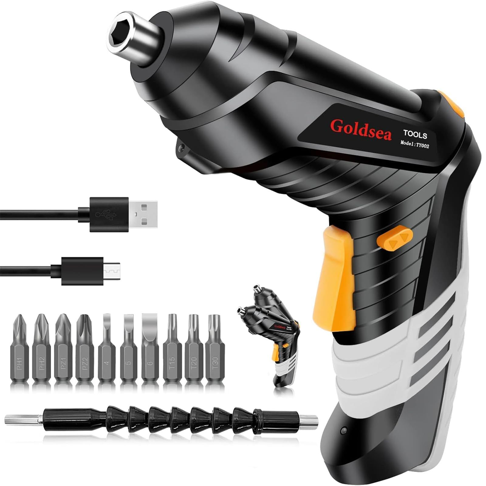
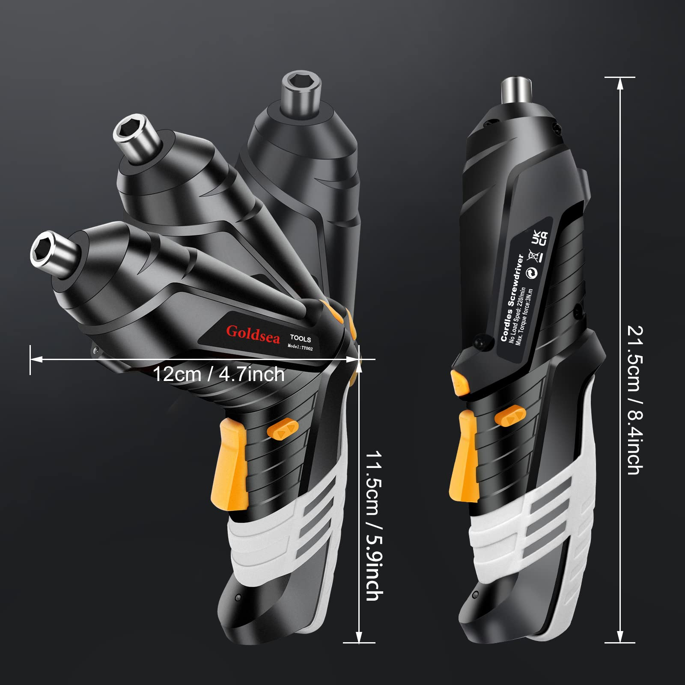
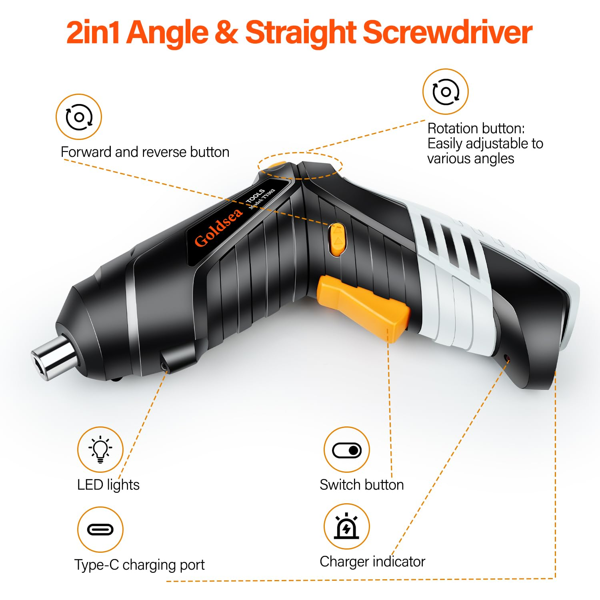
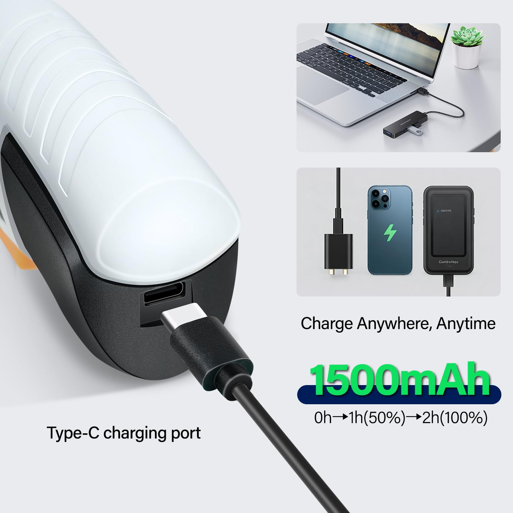
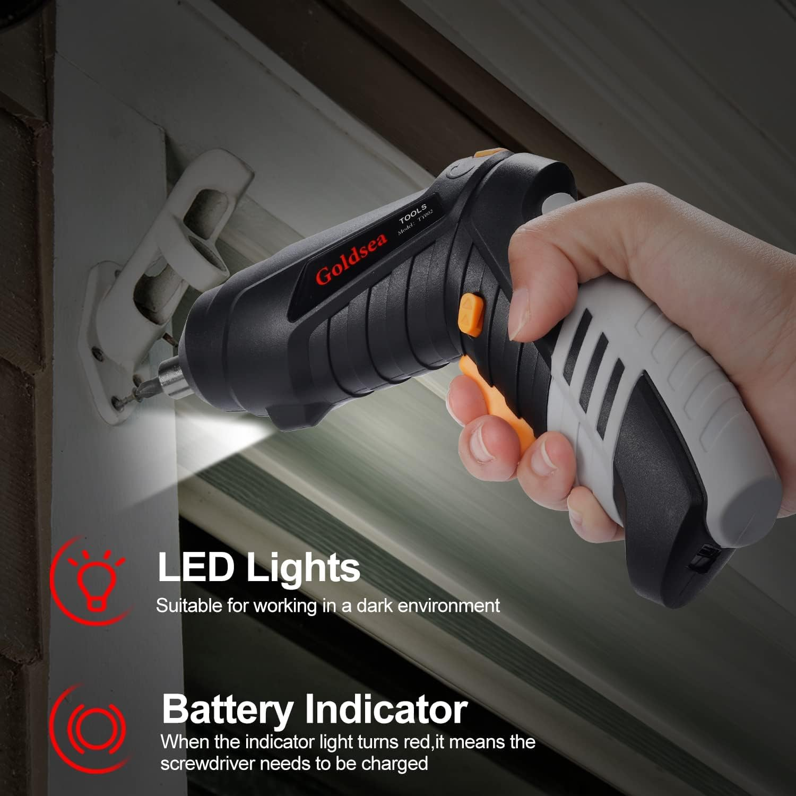
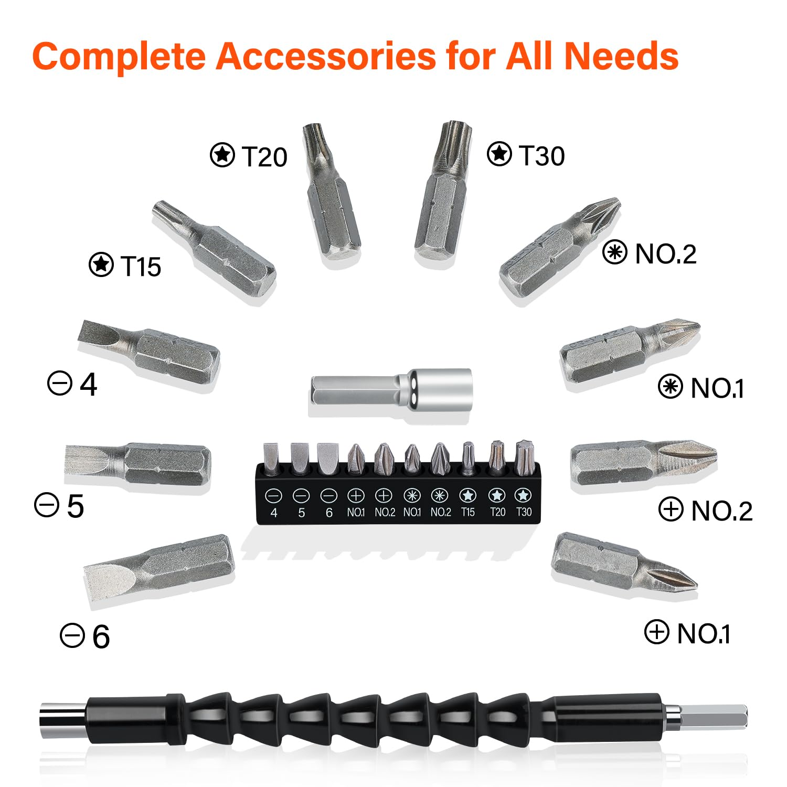
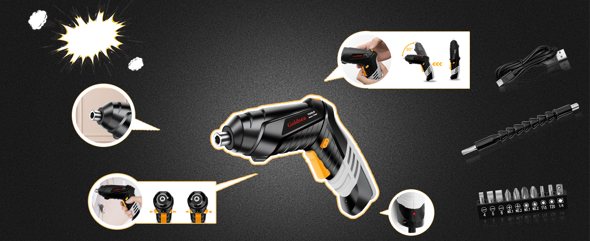
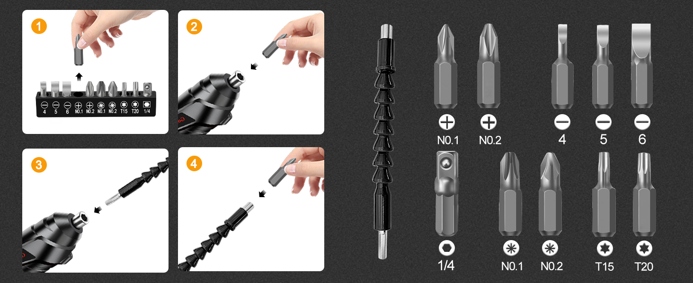
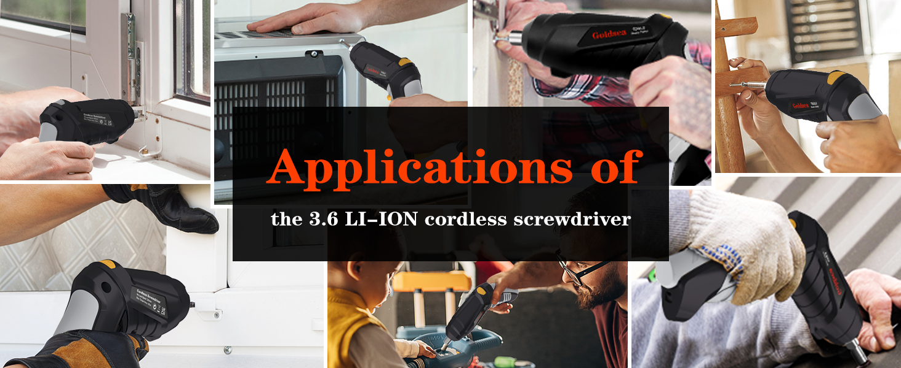

---
hide:
  - toc
---

<label for="site-language">Language</label><select id="site-language" data-language-select><option value="en">English</option><option value="ja">日本語</option><option value="de">Deutsch</option><option value="it">Italiano</option></select>

<h2 data-i18n="productGallery">Product Gallery</h2>

Home / Cordless Screwdrivers / B0BQW4MBN4

Price shown on Amazon

ASIN: B0BQW4MBN4
<a class="amazon-buy" href="https://www.amazon.com/dp/B0BQW4MBN4" target="_blank" rel="nofollow noopener" data-i18n="viewAmazon">View on Amazon</a><a class="amazon-secondary" href="../" data-i18n="backCatalog">Back to catalog</a>

<section data-lang-content="en">
<h1>Goldsea 4.2V Cordless Electric Screwdriver</h1>

Cordless electric screwdriver with 3.5 N.m torque, 1500 mAh Type-C rechargeable battery, 10 bits, 1/4 inch hex chuck, LED light and 90°/180° transformable handle.

<h2>Product Features</h2><ul><li>Electric/manual 2-in-1 mode lets users choose powered or manual fastening.</li><li>1500 mAh battery improves runtime compared with common 1000 mAh drivers.</li><li>Type-C charging supports repeated recharge without replacing batteries.</li><li>10 CRV screwdriver bits and magnetic 1/4 inch chuck cover common work needs.</li><li>400 g lightweight design and ergonomic anti-slip handle improve handling comfort.</li><li>PUSH transform handle switches between pistol and straight layouts for tight spaces.</li><li>Forward/reverse switch supports both screw tightening and screw removal.</li></ul>
<h2>Specifications</h2><table><tr><th>Speed</th><td>220 rpm</td></tr><tr><th>Power source</th><td>Battery powered</td></tr><tr><th>Voltage</th><td>3.6V / 4.2V class</td></tr><tr><th>Battery</th><td>1500 mAh</td></tr><tr><th>Chuck</th><td>0.25 inch</td></tr><tr><th>Dimensions</th><td>5.83 × 1.93 × 6.38 in</td></tr><tr><th>Included</th><td>Electric screwdriver, 10 bits, extension pole, charging cable, user manual</td></tr></table>
<h2>Selling Point Analysis</h2><ul><li>Goldsea 4.2V Cordless Electric Screwdriver has a clear use case in Cordless Screwdrivers, so buyers can quickly understand what problem it solves.</li><li>The screenshot text is converted into readable product copy instead of staying only inside images.</li><li>Product images are separated from A+ detail images to match an Amazon-style detail page.</li><li>The feature list highlights runtime, accessories, safety, operation and maintenance benefits where relevant.</li><li>The page supports multilingual visitors while keeping the Amazon purchase path clear.</li></ul>
<h2>Q&A</h2>

What is this product best used for?

Goldsea 4.2V Cordless Electric Screwdriver is best used for cordless screwdrivers tasks described in the uploaded product screenshots.

Where can I buy it?

Use the Amazon button to open ASIN B0BQW4MBN4.

Does the page use uploaded images?

Yes. The main gallery uses product-images and the A+ section uses A+-images.

Is live pricing shown here?

No. Amazon price and availability should be checked on Amazon.

What are the main selling points?

The key advantages are practical functionality, clear accessory bundle, easy operation and a direct purchase path.

Can more details be added later?

Yes. Additional screenshots or text files can be added to the ASIN folder and regenerated.

</section>
<section data-lang-content="ja" hidden>
<h1>Goldsea 4.2V Cordless Electric Screwdriver</h1>

スクリーンショットの商品情報を基に整理した説明です。Cordless electric ドライバー with 3.5 N.m torque, 1500 mAh Type-C rechargeable バッテリー, 10 bits, 1/4 inch hex chuck, LED light and 90°/180° transformable handle.

<h2>商品の特徴</h2><ul><li>Electric/manual 2-in-1 mode lets users choose powered or manual fastening.</li><li>1500 mAh バッテリー improves runtime compared with common 1000 mAh drivers.</li><li>Type-C charging supports repeated recharge without replacing batteries.</li><li>10 CRV ドライバー bits and magnetic 1/4 inch chuck cover common work needs.</li><li>400 g lightweight design and ergonomic anti-slip handle improve handling comfort.</li><li>PUSH transform handle switches between pistol and straight layouts for tight spaces.</li><li>Forward/reverse switch supports both screw tightening and screw removal.</li></ul>
<h2>仕様</h2><table><tr><th>Speed</th><td>220 rpm</td></tr><tr><th>Power source</th><td>バッテリー powered</td></tr><tr><th>Voltage</th><td>3.6V / 4.2V class</td></tr><tr><th>バッテリー</th><td>1500 mAh</td></tr><tr><th>Chuck</th><td>0.25 inch</td></tr><tr><th>Dimensions</th><td>5.83 × 1.93 × 6.38 in</td></tr><tr><th>Included</th><td>Electric ドライバー, 10 bits, extension pole, charging cable, user manual</td></tr></table>
<h2>セールスポイント分析</h2><ul><li>Goldsea 4.2V Cordless Electric Screwdriver has a clear use case in Cordless Screwdrivers, so buyers can quickly understand what problem it solves.</li><li>The screenshot text is converted into readable product copy instead of staying only inside images.</li><li>商品 images are separated from A+ detail images to match an Amazon-style detail page.</li><li>The feature list highlights runtime, accessories, safety, operation and maintenance benefits where relevant.</li><li>The page supports multilingual visitors while keeping the Amazon purchase path clear.</li></ul>
<h2>よくある質問</h2>

この商品は何に適していますか？

Goldsea 4.2V Cordless Electric Screwdriver is best used for コードレス ドライバーs tasks described in the uploaded product screenshots.

どこで購入できますか？

Use the Amazon button to open ASIN B0BQW4MBN4.

このページはアップロード画像を使用していますか？

Yes. The main gallery uses product-images and the A+ section uses A+-images.

ここにリアルタイム価格は表示されますか？

No. Amazon price and availability should be checked on Amazon.

主なセールスポイントは何ですか？

The key advantages are practical functionality, clear accessory bundle, easy operation and a direct purchase path.

後から詳細を追加できますか？

Yes. Additional screenshots or text files can be added to the ASIN folder and regenerated.

</section>
<section data-lang-content="de" hidden>
<h1>Goldsea 4.2V Cordless Electric Screwdriver</h1>

Aus den hochgeladenen Produkt-Screenshots aufbereitete Beschreibung: Cordless electric Schraubendreher with 3.5 N.m torque, 1500 mAh Type-C rechargeable Akku, 10 bits, 1/4 inch hex chuck, LED light and 90°/180° transformable handle.

<h2>Produktmerkmale</h2><ul><li>Electric/manual 2-in-1 mode lets users choose powered or manual fastening.</li><li>1500 mAh Akku improves runtime compared with common 1000 mAh drivers.</li><li>Type-C charging supports repeated recharge without replacing batteries.</li><li>10 CRV Schraubendreher bits and magnetic 1/4 inch chuck cover common work needs.</li><li>400 g lightweight design and ergonomic anti-slip handle improve handling comfort.</li><li>PUSH transform handle switches between pistol and straight layouts for tight spaces.</li><li>Forward/reverse switch supports both screw tightening and screw removal.</li></ul>
<h2>Spezifikationen</h2><table><tr><th>Speed</th><td>220 rpm</td></tr><tr><th>Power source</th><td>Akku powered</td></tr><tr><th>Voltage</th><td>3.6V / 4.2V class</td></tr><tr><th>Akku</th><td>1500 mAh</td></tr><tr><th>Chuck</th><td>0.25 inch</td></tr><tr><th>Dimensions</th><td>5.83 × 1.93 × 6.38 in</td></tr><tr><th>Included</th><td>Electric Schraubendreher, 10 bits, extension pole, charging cable, user manual</td></tr></table>
<h2>Verkaufsargumente</h2><ul><li>Goldsea 4.2V Cordless Electric Screwdriver has a clear use case in Cordless Screwdrivers, so buyers can quickly understand what problem it solves.</li><li>The screenshot text is converted into readable product copy instead of staying only inside images.</li><li>Product images are separated from A+ detail images to match an Amazon-style detail page.</li><li>The feature list highlights runtime, accessories, safety, operation and maintenance benefits where relevant.</li><li>The page supports multilingual visitors while keeping the Amazon purchase path clear.</li></ul>
<h2>Fragen und Antworten</h2>

Wofür eignet sich dieses Produkt am besten?

Goldsea 4.2V Cordless Electric Screwdriver is best used for kabelloser Schraubendrehers tasks described in the uploaded product screenshots.

Wo kann ich es kaufen?

Use the Amazon button to open ASIN B0BQW4MBN4.

Verwendet die Seite hochgeladene Bilder?

Yes. The main gallery uses product-images and the A+ section uses A+-images.

Wird hier der Live-Preis angezeigt?

No. Amazon price and availability should be checked on Amazon.

Was sind die wichtigsten Verkaufsargumente?

The key advantages are practical functionality, clear accessory bundle, easy operation and a direct purchase path.

Können später weitere Details hinzugefügt werden?

Yes. Additional screenshots or text files can be added to the ASIN folder and regenerated.

</section>
<section data-lang-content="it" hidden>
<h1>Goldsea 4.2V Cordless Electric Screwdriver</h1>

Descrizione rielaborata dagli screenshot del prodotto caricati: Cordless electric cacciavite with 3.5 N.m torque, 1500 mAh Type-C rechargeable batteria, 10 bits, 1/4 inch hex chuck, LED light and 90°/180° transformable handle.

<h2>Caratteristiche del prodotto</h2><ul><li>Electric/manual 2-in-1 mode lets users choose powered or manual fastening.</li><li>1500 mAh batteria improves runtime compared with common 1000 mAh drivers.</li><li>Type-C charging supports repeated recharge without replacing batteries.</li><li>10 CRV cacciavite bits and magnetic 1/4 inch chuck cover common work needs.</li><li>400 g lightweight design and ergonomic anti-slip handle improve handling comfort.</li><li>PUSH transform handle switches between pistol and straight layouts for tight spaces.</li><li>Forward/reverse switch supports both screw tightening and screw removal.</li></ul>
<h2>Specifiche</h2><table><tr><th>Speed</th><td>220 rpm</td></tr><tr><th>Power source</th><td>batteria powered</td></tr><tr><th>Voltage</th><td>3.6V / 4.2V class</td></tr><tr><th>batteria</th><td>1500 mAh</td></tr><tr><th>Chuck</th><td>0.25 inch</td></tr><tr><th>Dimensions</th><td>5.83 × 1.93 × 6.38 in</td></tr><tr><th>Included</th><td>Electric cacciavite, 10 bits, extension pole, charging cable, user manual</td></tr></table>
<h2>Analisi dei punti di forza</h2><ul><li>Goldsea 4.2V Cordless Electric Screwdriver has a clear use case in Cordless Screwdrivers, so buyers can quickly understand what problem it solves.</li><li>The screenshot text is converted into readable product copy instead of staying only inside images.</li><li>Product images are separated from A+ detail images to match an Amazon-style detail page.</li><li>The feature list highlights runtime, accessories, safety, operation and maintenance benefits where relevant.</li><li>The page supports multilingual visitors while keeping the Amazon purchase path clear.</li></ul>
<h2>Domande e risposte</h2>

Per cosa è più adatto questo prodotto?

Goldsea 4.2V Cordless Electric Screwdriver is best used for senza fili cacciavites tasks described in the uploaded product screenshots.

Dove posso acquistarlo?

Use the Amazon button to open ASIN B0BQW4MBN4.

La pagina usa immagini caricate?

Yes. The main gallery uses product-images and the A+ section uses A+-images.

Il prezzo in tempo reale è mostrato qui?

No. Amazon price and availability should be checked on Amazon.

Quali sono i principali punti di forza?

The key advantages are practical functionality, clear accessory bundle, easy operation and a direct purchase path.

Si possono aggiungere altri dettagli in seguito?

Yes. Additional screenshots or text files can be added to the ASIN folder and regenerated.

</section>

<section class="aplus-section"><h2 data-i18n="aplusImages">A+ Detail Images</h2>

</section>
