---
hide:
  - toc
---

<label for="site-language">Language</label><select id="site-language" data-language-select><option value="en">English</option><option value="ja">日本語</option><option value="de">Deutsch</option><option value="it">Italiano</option></select>

<h2 data-i18n="productGallery">Product Gallery</h2>
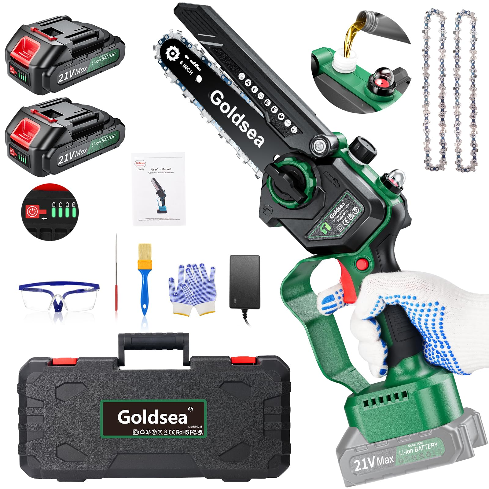

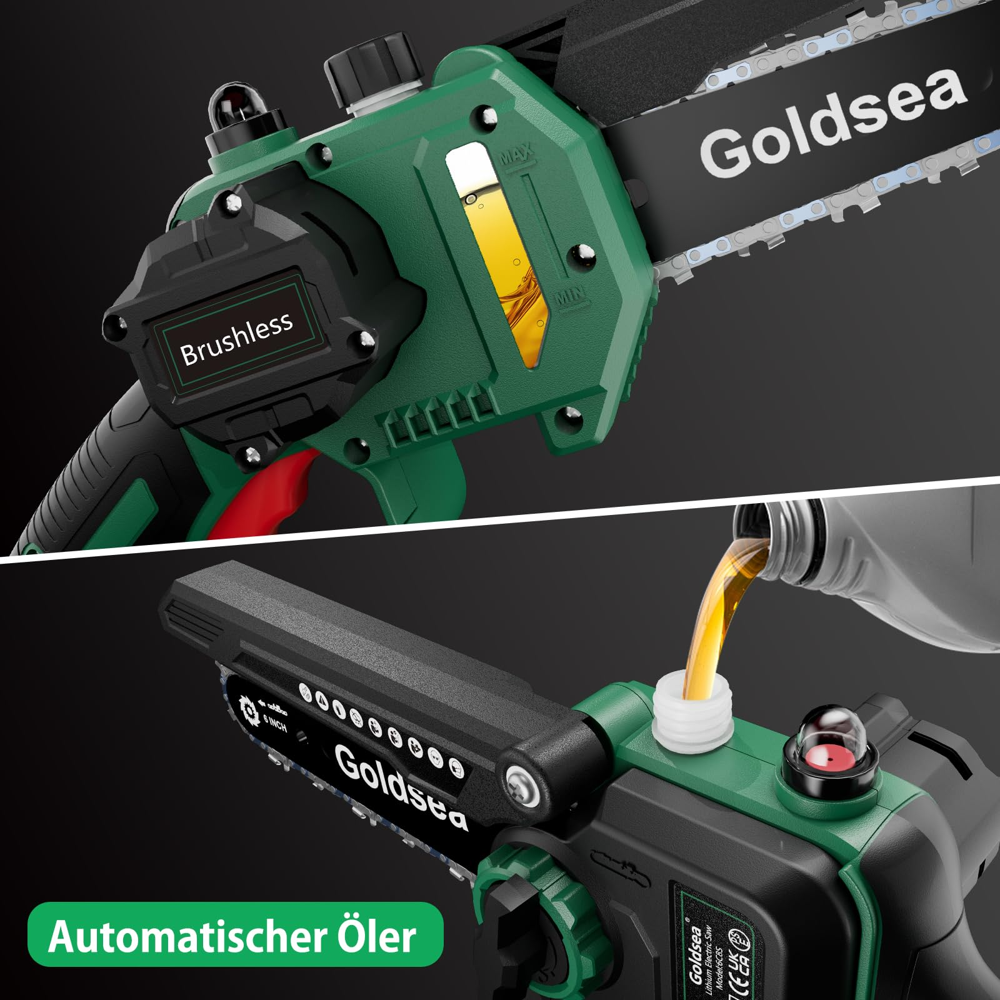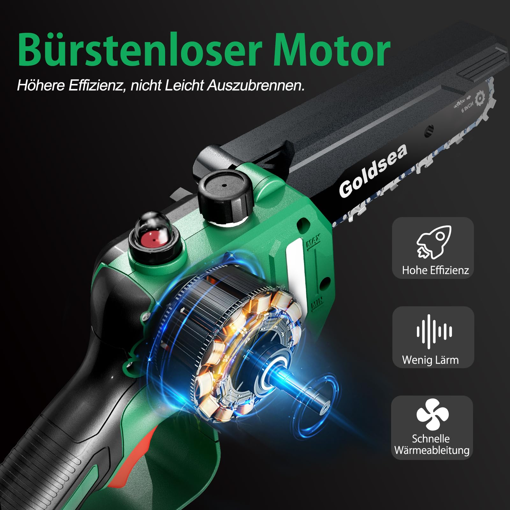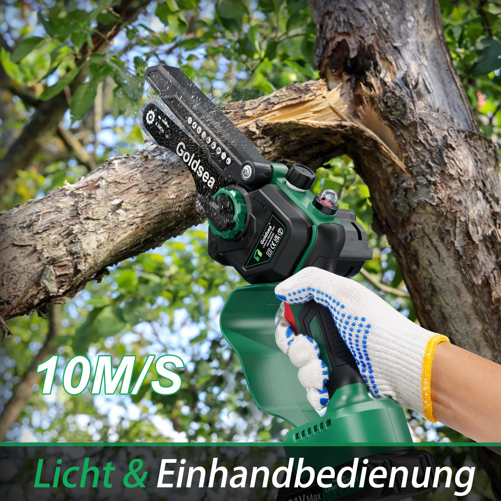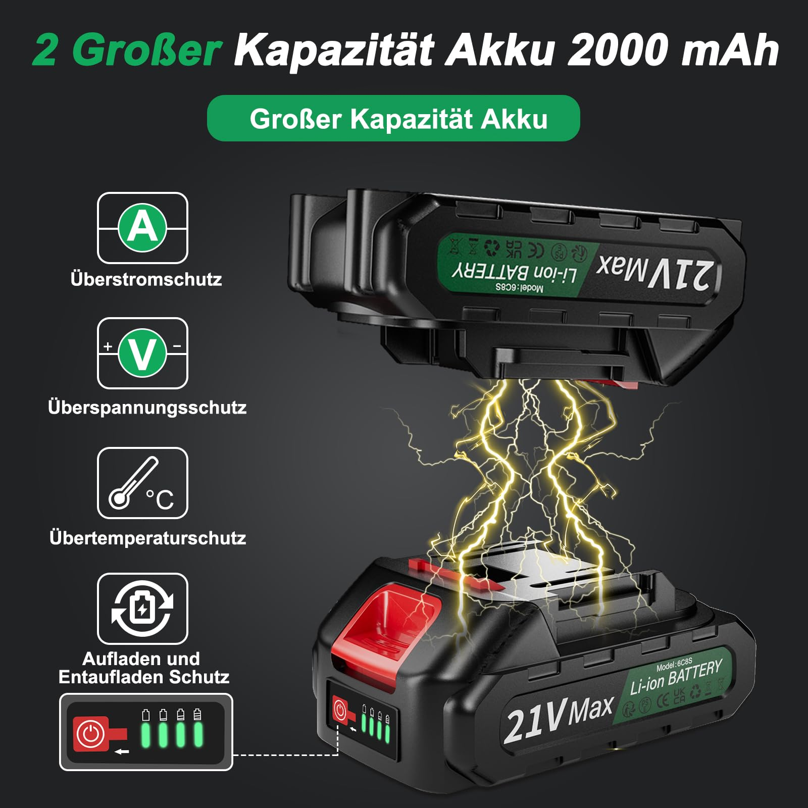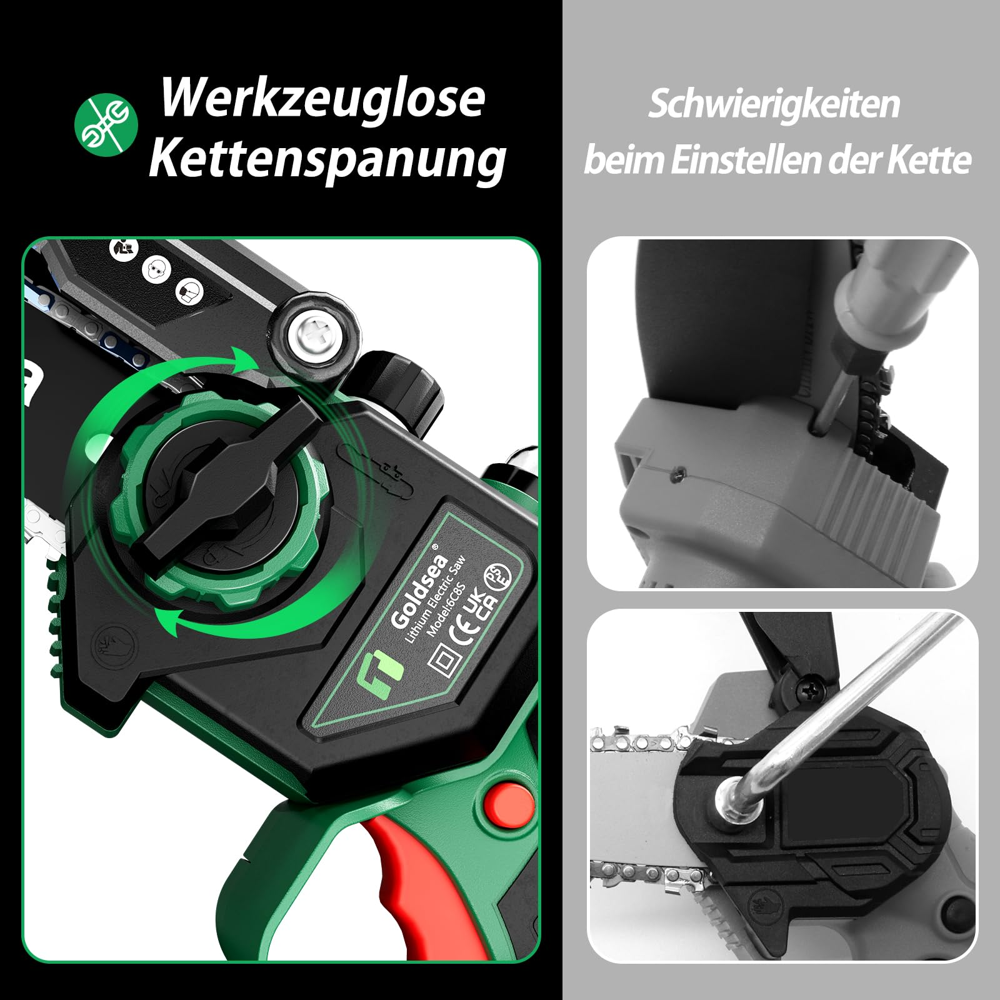

Home / Mini Chainsaws / B0C48Z1HBR

Price shown on Amazon

ASIN: B0C48Z1HBR
<a class="amazon-buy" href="https://www.amazon.com/dp/B0C48Z1HBR" target="_blank" rel="nofollow noopener" data-i18n="viewAmazon">View on Amazon</a><a class="amazon-secondary" href="../" data-i18n="backCatalog">Back to catalog</a>

<section class="product-copy" data-product-copy>
<h1 data-product-title>Goldsea 6 Inch Mini Chainsaw with Battery and Charger</h1>

Portable battery hand chainsaw with brushless motor, automatic chain lubrication, tool-free chain tension and two batteries for garden cutting and pruning.

<h2 data-product-features-title>Product Features</h2><ul data-product-features><li>Two 2.0 Ah Li-ion batteries and fast charger allow alternate use and up to 35 cuts per full charge.</li><li>Battery level display makes it clear when charging is needed.</li><li>Tool-free chain change and tension adjustment simplify maintenance.</li><li>Automatic chain lubrication extends blade and chain life.</li><li>800W brushless motor works with heat-hardened chain for smooth low-noise cutting.</li><li>24-hour customer service is highlighted for after-sales questions.</li></ul>
<h2 data-product-specs-title>Specifications</h2><table data-product-specs><tr><th>Power source</th><td>Corded electric / battery system</td></tr><tr><th>Motor</th><td>800W brushless</td></tr><tr><th>Weight</th><td>2.88 kg</td></tr><tr><th>Dimensions</th><td>21 × 15 × 44 cm</td></tr><tr><th>UPC</th><td>717981725029</td></tr><tr><th>Included</th><td>Chainsaw</td></tr><tr><th>Best seller rank</th><td>Garden / Chain Saws</td></tr><tr><th>ASIN</th><td>B0C48Z1HBR</td></tr></table>
<h2 data-product-analysis-title>Selling Point Analysis</h2><ul data-product-analysis><li>Goldsea 6 Inch Mini Chainsaw with Battery and Charger has a clear use case in Mini Chainsaws, so buyers can quickly understand what problem it solves.</li><li>The screenshot text is converted into readable product copy instead of staying only inside images.</li><li>Product images are separated from A+ detail images to match an Amazon-style detail page.</li><li>The feature list highlights runtime, accessories, safety, operation and maintenance benefits where relevant.</li><li>The page supports multilingual visitors while keeping the Amazon purchase path clear.</li></ul>
<h2 data-product-qa-title>Q&A</h2>

What is this product best used for?

Goldsea 6 Inch Mini Chainsaw with Battery and Charger is best used for mini chainsaws tasks described in the uploaded product screenshots.

Where can I buy it?

Use the Amazon button to open ASIN B0C48Z1HBR.

Does the page use uploaded images?

Yes. The main gallery uses product-images and the A+ section uses A+-images.

Is live pricing shown here?

No. Amazon price and availability should be checked on Amazon.

What are the main selling points?

The key advantages are practical functionality, clear accessory bundle, easy operation and a direct purchase path.

Can more details be added later?

Yes. Additional screenshots or text files can be added to the ASIN folder and regenerated.

</section>

<section class="aplus-section"><h2 data-i18n="aplusImages">A+ Detail Images</h2>
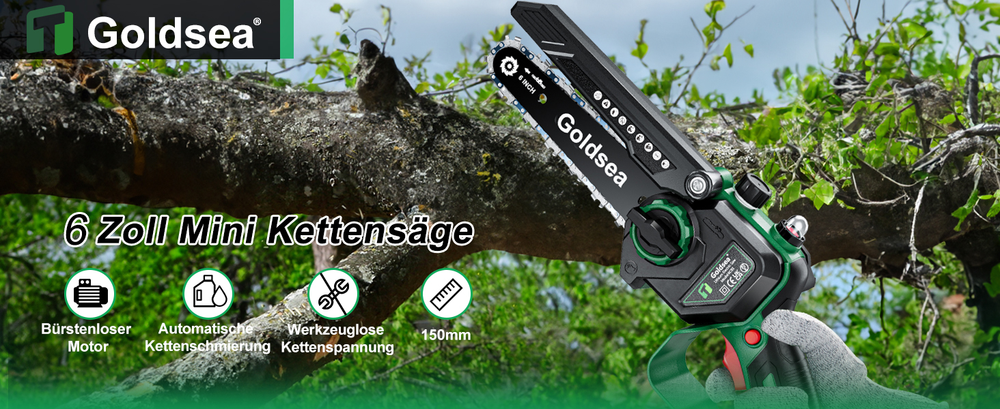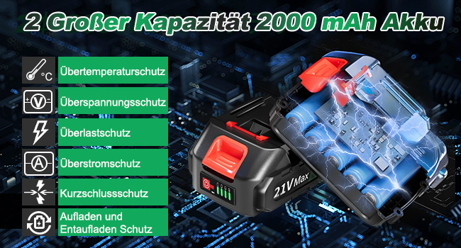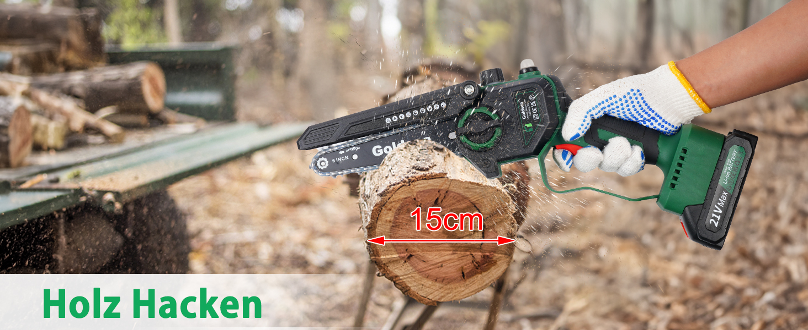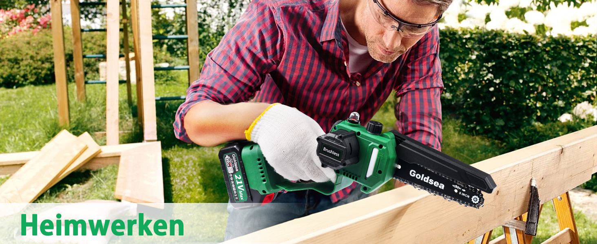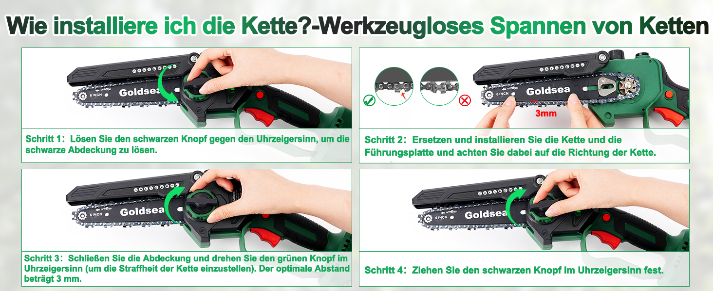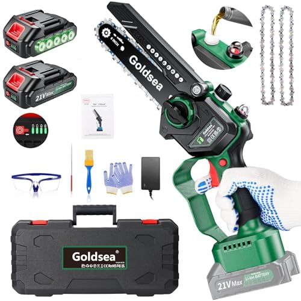
</section>

