---
hide:
  - toc
---

<label for="site-language">Language</label><select id="site-language" data-language-select><option value="en">English</option><option value="ja">日本語</option><option value="de">Deutsch</option><option value="it">Italiano</option></select>

<h2 data-i18n="productGallery">Product Gallery</h2>
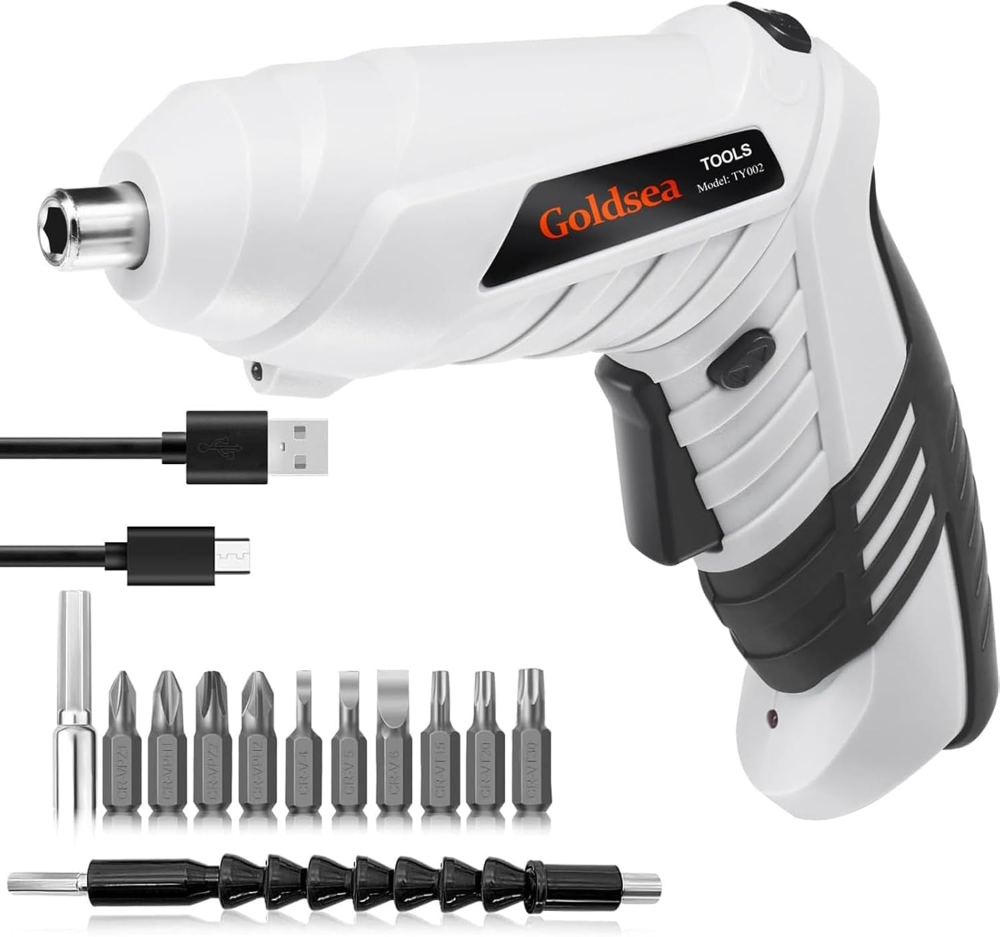

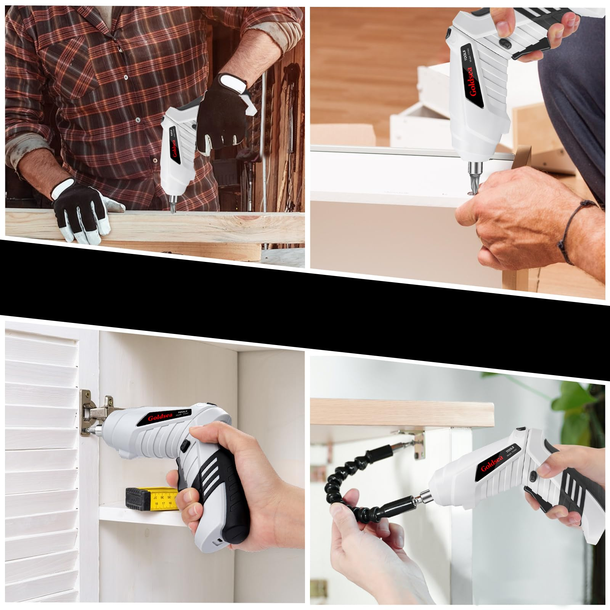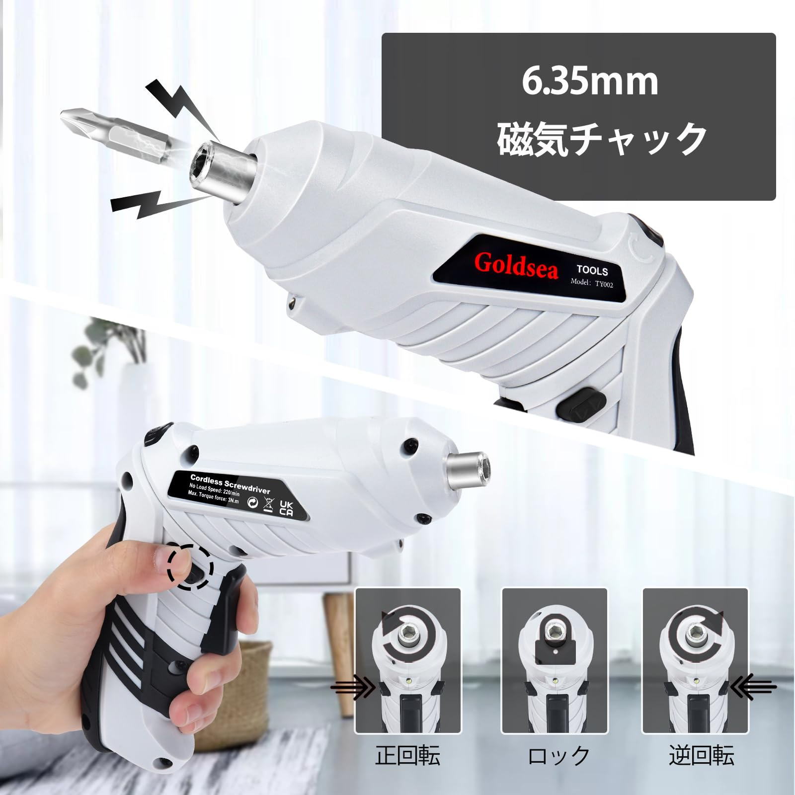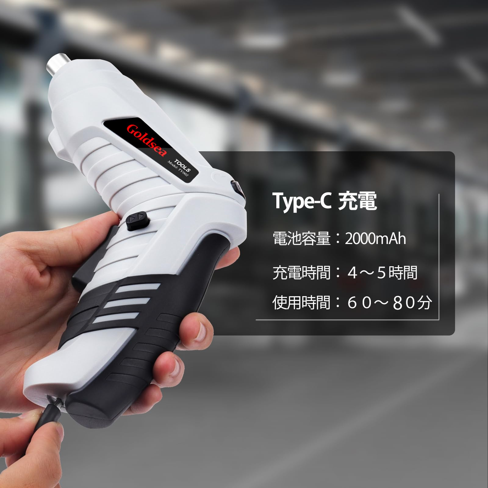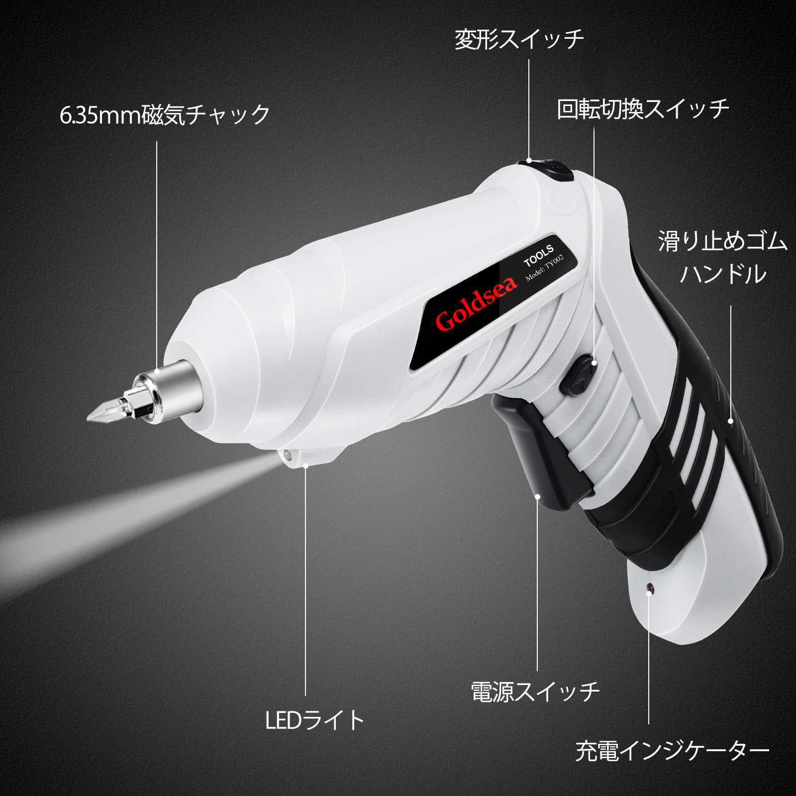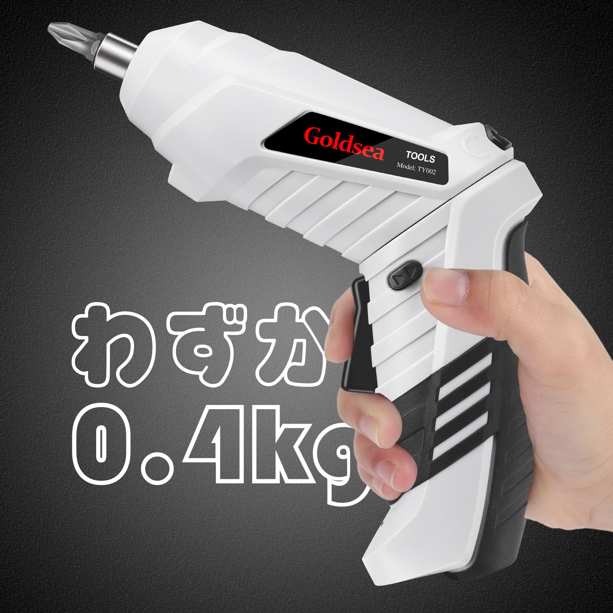

Home / Cordless Screwdrivers / B0CFFK4V9K

Price shown on Amazon

ASIN: B0CFFK4V9K
<a class="amazon-buy" href="https://www.amazon.com/dp/B0CFFK4V9K" target="_blank" rel="nofollow noopener" data-i18n="viewAmazon">View on Amazon</a><a class="amazon-secondary" href="../" data-i18n="backCatalog">Back to catalog</a>

<section class="product-copy" data-product-copy>
<h1 data-product-title>Goldsea White 4.2V Mini Electric Screwdriver</h1>

White compact 4.2V mini electric screwdriver with 3.5 N.m torque, 1500 mAh Type-C charging, LED light, 10 bits and transformable handle for DIY furniture assembly.

<h2 data-product-features-title>Product Features</h2><ul data-product-features><li>Manual/electric 2-in-1 screwdriver adapts to different work situations.</li><li>3.5 N.m torque and 1500 mAh battery improve work efficiency.</li><li>Type-C charging removes the need for disposable battery replacement.</li><li>10 screwdriver bits and magnetic chuck handle everyday furniture and appliance maintenance.</li><li>400 g compact body with rubber grip is lightweight, practical and durable.</li><li>Transformable handle switches from pistol to straight form for narrow work areas.</li><li>Forward/reverse switch changes bit direction for tightening and loosening.</li></ul>
<h2 data-product-specs-title>Specifications</h2><table data-product-specs><tr><th>Power source</th><td>Battery powered</td></tr><tr><th>Voltage</th><td>4.2V DC</td></tr><tr><th>Torque</th><td>4 N.m class</td></tr><tr><th>Brand</th><td>Goldsea</td></tr><tr><th>Included</th><td>Drill attachment, electric screwdriver body</td></tr><tr><th>Dimensions</th><td>15 × 5.1 × 15 cm</td></tr><tr><th>ASIN</th><td>B0CFFK4V9K</td></tr></table>
<h2 data-product-analysis-title>Selling Point Analysis</h2><ul data-product-analysis><li>Goldsea White 4.2V Mini Electric Screwdriver has a clear use case in Cordless Screwdrivers, so buyers can quickly understand what problem it solves.</li><li>The screenshot text is converted into readable product copy instead of staying only inside images.</li><li>Product images are separated from A+ detail images to match an Amazon-style detail page.</li><li>The feature list highlights runtime, accessories, safety, operation and maintenance benefits where relevant.</li><li>The page supports multilingual visitors while keeping the Amazon purchase path clear.</li></ul>
<h2 data-product-qa-title>Q&A</h2>

What is this product best used for?

Goldsea White 4.2V Mini Electric Screwdriver is best used for cordless screwdrivers tasks described in the uploaded product screenshots.

Where can I buy it?

Use the Amazon button to open ASIN B0CFFK4V9K.

Does the page use uploaded images?

Yes. The main gallery uses product-images and the A+ section uses A+-images.

Is live pricing shown here?

No. Amazon price and availability should be checked on Amazon.

What are the main selling points?

The key advantages are practical functionality, clear accessory bundle, easy operation and a direct purchase path.

Can more details be added later?

Yes. Additional screenshots or text files can be added to the ASIN folder and regenerated.

</section>

<section class="aplus-section"><h2 data-i18n="aplusImages">A+ Detail Images</h2>
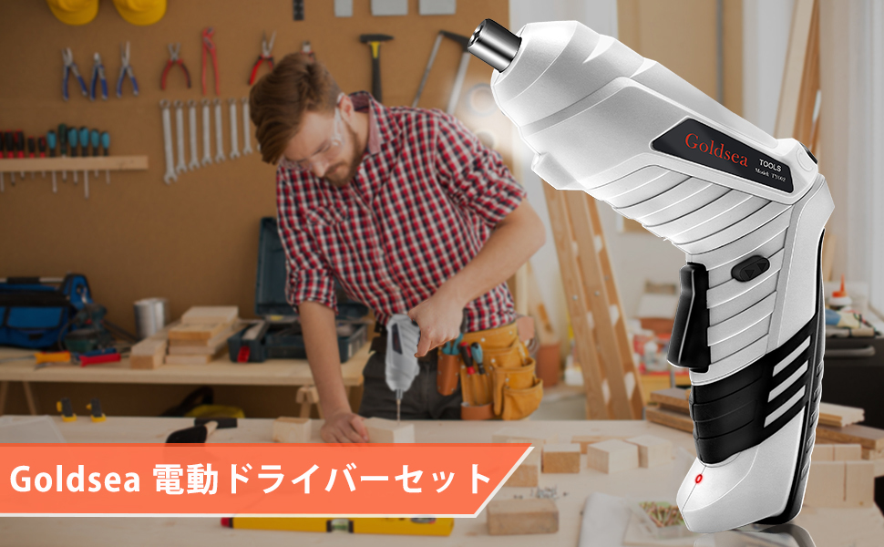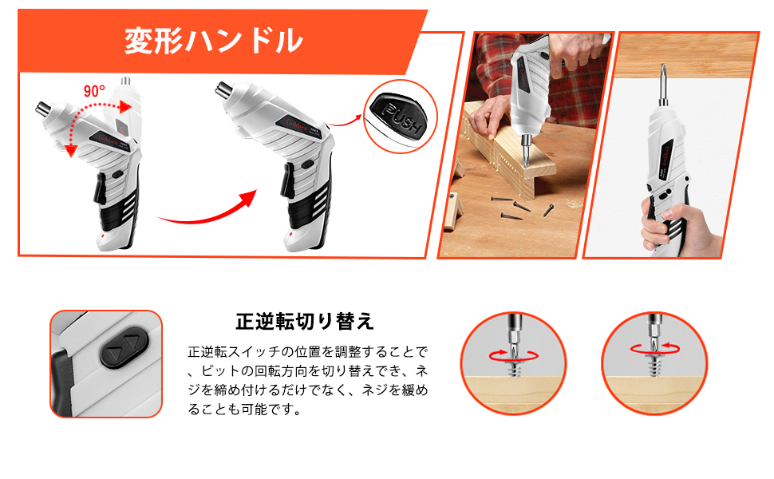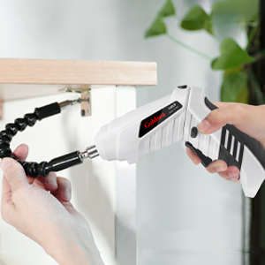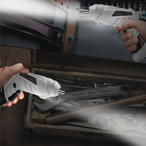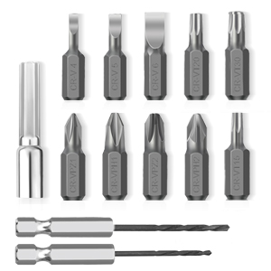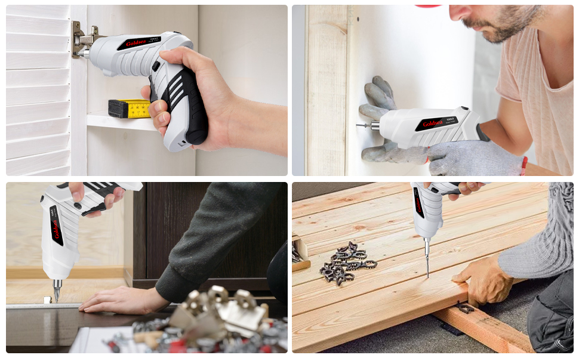
</section>

