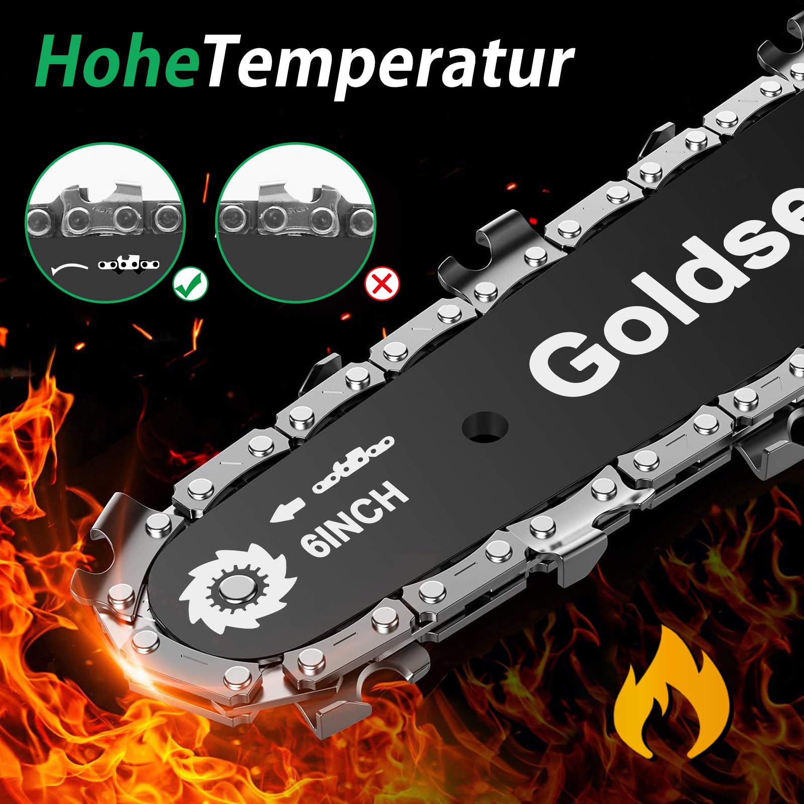
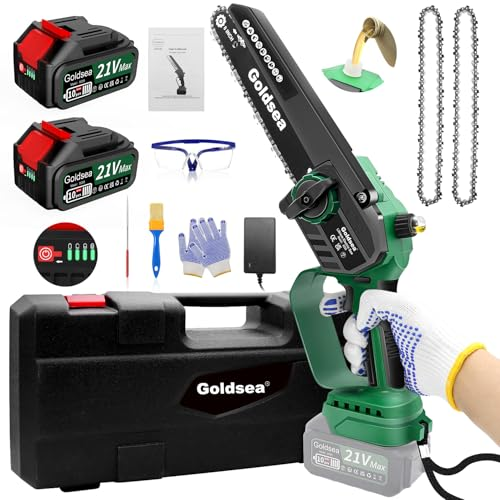
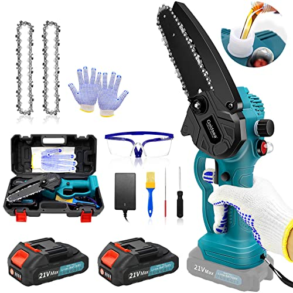
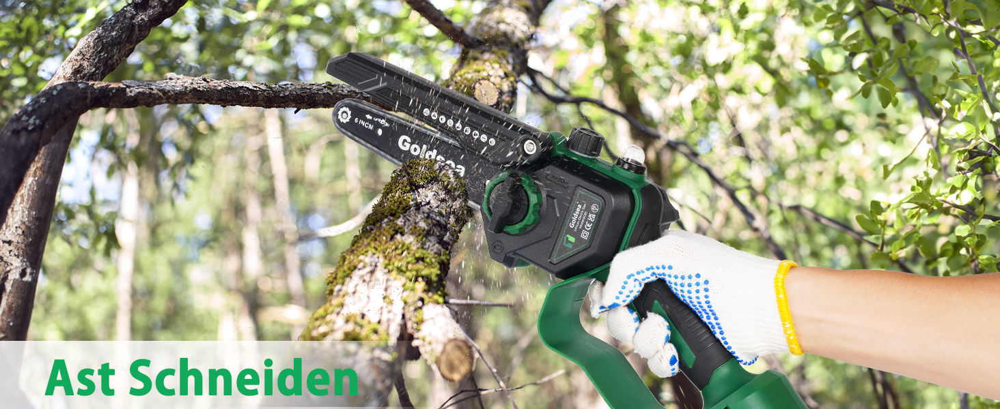

---
hide:
  - toc
---

<label for="site-language">Language</label><select id="site-language" data-language-select><option value="en">English</option><option value="ja">日本語</option><option value="de">Deutsch</option><option value="it">Italiano</option></select>

<h2 data-i18n="productGallery">Product Gallery</h2>

Home / Mini Chainsaws / B0GWZCBMB7

Price shown on Amazon

ASIN: B0GWZCBMB7
<a class="amazon-buy" href="https://www.amazon.com/dp/B0GWZCBMB7" target="_blank" rel="nofollow noopener" data-i18n="viewAmazon">View on Amazon</a><a class="amazon-secondary" href="../" data-i18n="backCatalog">Back to catalog</a>

<section data-lang-content="en" style="display:block">
<h1>Goldsea Portable Battery Hand Chainsaw</h1>

Portable 6 inch battery chainsaw with charger, brushless motor, automatic chain lubrication and tool-free chain tension for garden pruning and wood cutting.

<h2>Product Features</h2><ul><li>Two 2.0 Ah batteries and EU fast charger support alternating battery use.</li><li>Battery level display helps users know when to recharge.</li><li>Tool-free chain tension and chain changes avoid extra tools during maintenance.</li><li>Automatic chain lubrication keeps the blade and chain protected during work.</li><li>800W brushless motor and sharp heat-hardened chain cut smoothly and quietly.</li><li>Designed for garden pruning, tree cutting, camping and daily yard work.</li></ul>
<h2>Specifications</h2><table><tr><th>Power source</th><td>Corded electric / battery system</td></tr><tr><th>Horsepower</th><td>800</td></tr><tr><th>Weight</th><td>2.88 kg</td></tr><tr><th>Dimensions</th><td>21 × 15 × 44 cm</td></tr><tr><th>Brand</th><td>Goldsea</td></tr><tr><th>Category</th><td>Mini chainsaw</td></tr><tr><th>ASIN</th><td>B0GWZCBMB7</td></tr></table>
<h2>Selling Point Analysis</h2><ul><li>Goldsea Portable Battery Hand Chainsaw has a clear use case in Mini Chainsaws, so buyers can quickly understand what problem it solves.</li><li>The screenshot text is converted into readable product copy instead of staying only inside images.</li><li>Product images are separated from A+ detail images to match an Amazon-style detail page.</li><li>The feature list highlights runtime, accessories, safety, operation and maintenance benefits where relevant.</li><li>The page supports multilingual visitors while keeping the Amazon purchase path clear.</li></ul>
<h2>Q&A</h2>

What is this product best used for?

Goldsea Portable Battery Hand Chainsaw is best used for mini chainsaws tasks described in the uploaded product screenshots.

Where can I buy it?

Use the Amazon button to open ASIN B0GWZCBMB7.

Does the page use uploaded images?

Yes. The main gallery uses product-images and the A+ section uses A+-images.

Is live pricing shown here?

No. Amazon price and availability should be checked on Amazon.

What are the main selling points?

The key advantages are practical functionality, clear accessory bundle, easy operation and a direct purchase path.

Can more details be added later?

Yes. Additional screenshots or text files can be added to the ASIN folder and regenerated.

</section>
<section data-lang-content="ja" style="display:none">
<h1>Goldsea Portable バッテリー Hand Chainsaw</h1>

スクリーンショットの商品情報を基に整理した説明です。Portable 6 inch バッテリー chainsaw with charger, ブラシレスモーター, 自動チェーン給油 and 工具不要のチェーン調整 for 庭木 剪定 and wood 切断.

<h2>商品の特徴</h2><ul><li>Two 2.0 Ah batteries and EU fast charger support alternating バッテリー use.</li><li>バッテリー level display helps users know when to recharge.</li><li>Tool-free chain tension and chain changes avoid extra tools during maintenance.</li><li>Automatic chain lubrication keeps the blade and chain protected during work.</li><li>800W ブラシレスモーター and sharp heat-hardened chain cut smoothly and quietly.</li><li>Designed for 庭木 剪定, tree 切断, camping and daily yard work.</li></ul>
<h2>仕様</h2><table><tr><th>Power source</th><td>Corded electric / バッテリー system</td></tr><tr><th>Horsepower</th><td>800</td></tr><tr><th>Weight</th><td>2.88 kg</td></tr><tr><th>Dimensions</th><td>21 × 15 × 44 cm</td></tr><tr><th>Brand</th><td>Goldsea</td></tr><tr><th>Category</th><td>Mini chainsaw</td></tr><tr><th>ASIN</th><td>B0GWZCBMB7</td></tr></table>
<h2>セールスポイント分析</h2><ul><li>Goldsea Portable バッテリー Hand Chainsaw has a clear use case in ミニチェーンソーs, so buyers can quickly understand what problem it solves.</li><li>The screenshot text is converted into readable product copy instead of staying only inside images.</li><li>商品 images are separated from A+ detail images to match an Amazon-style detail page.</li><li>The feature list highlights runtime, accessories, safety, operation and maintenance benefits where relevant.</li><li>The page supports multilingual visitors while keeping the Amazon purchase path clear.</li></ul>
<h2>よくある質問</h2>

この商品は何に適していますか？

Goldsea Portable バッテリー Hand Chainsaw is best used for mini chainsaws tasks described in the uploaded product screenshots.

どこで購入できますか？

Use the Amazon button to open ASIN B0GWZCBMB7.

このページはアップロード画像を使用していますか？

Yes. The main gallery uses product-images and the A+ section uses A+-images.

ここにリアルタイム価格は表示されますか？

No. Amazon price and availability should be checked on Amazon.

主なセールスポイントは何ですか？

The key advantages are practical functionality, clear accessory bundle, easy operation and a direct purchase path.

後から詳細を追加できますか？

Yes. Additional screenshots or text files can be added to the ASIN folder and regenerated.

</section>
<section data-lang-content="de" style="display:none">
<h1>Goldsea Portable Akku Hand Chainsaw</h1>

Aus den hochgeladenen Produkt-Screenshots aufbereitete Beschreibung: Portable 6 inch Akku chainsaw with charger, bürstenlosem Motor, automatischer Kettenschmierung and werkzeugloser Kettenspannung for Garten Beschneiden and wood Schneiden.

<h2>Produktmerkmale</h2><ul><li>Two 2.0 Ah batteries and EU fast charger support alternating Akku use.</li><li>Akku level display helps users know when to recharge.</li><li>Tool-free chain tension and chain changes avoid extra tools during maintenance.</li><li>Automatic chain lubrication keeps the blade and chain protected during work.</li><li>800W bürstenlosem Motor and sharp heat-hardened chain cut smoothly and quietly.</li><li>Designed for Garten Beschneiden, tree Schneiden, camping and daily yard work.</li></ul>
<h2>Spezifikationen</h2><table><tr><th>Power source</th><td>Corded electric / Akku system</td></tr><tr><th>Horsepower</th><td>800</td></tr><tr><th>Weight</th><td>2.88 kg</td></tr><tr><th>Dimensions</th><td>21 × 15 × 44 cm</td></tr><tr><th>Brand</th><td>Goldsea</td></tr><tr><th>Category</th><td>Mini chainsaw</td></tr><tr><th>ASIN</th><td>B0GWZCBMB7</td></tr></table>
<h2>Verkaufsargumente</h2><ul><li>Goldsea Portable Akku Hand Chainsaw has a clear use case in Mini-Kettensäges, so buyers can quickly understand what problem it solves.</li><li>The screenshot text is converted into readable product copy instead of staying only inside images.</li><li>Product images are separated from A+ detail images to match an Amazon-style detail page.</li><li>The feature list highlights runtime, accessories, safety, operation and maintenance benefits where relevant.</li><li>The page supports multilingual visitors while keeping the Amazon purchase path clear.</li></ul>
<h2>Fragen und Antworten</h2>

Wofür eignet sich dieses Produkt am besten?

Goldsea Portable Akku Hand Chainsaw is best used for mini chainsaws tasks described in the uploaded product screenshots.

Wo kann ich es kaufen?

Use the Amazon button to open ASIN B0GWZCBMB7.

Verwendet die Seite hochgeladene Bilder?

Yes. The main gallery uses product-images and the A+ section uses A+-images.

Wird hier der Live-Preis angezeigt?

No. Amazon price and availability should be checked on Amazon.

Was sind die wichtigsten Verkaufsargumente?

The key advantages are practical functionality, clear accessory bundle, easy operation and a direct purchase path.

Können später weitere Details hinzugefügt werden?

Yes. Additional screenshots or text files can be added to the ASIN folder and regenerated.

</section>
<section data-lang-content="it" style="display:none">
<h1>Goldsea Portable batteria Hand Chainsaw</h1>

Descrizione rielaborata dagli screenshot del prodotto caricati: Portable 6 inch batteria chainsaw with charger, motore brushless, lubrificazione automatica della catena and tensionamento catena senza utensili for giardino potatura and wood taglio.

<h2>Caratteristiche del prodotto</h2><ul><li>Two 2.0 Ah batteries and EU fast charger support alternating batteria use.</li><li>batteria level display helps users know when to recharge.</li><li>Tool-free chain tension and chain changes avoid extra tools during maintenance.</li><li>Automatic chain lubrication keeps the blade and chain protected during work.</li><li>800W motore brushless and sharp heat-hardened chain cut smoothly and quietly.</li><li>Designed for giardino potatura, tree taglio, camping and daily yard work.</li></ul>
<h2>Specifiche</h2><table><tr><th>Power source</th><td>Corded electric / batteria system</td></tr><tr><th>Horsepower</th><td>800</td></tr><tr><th>Weight</th><td>2.88 kg</td></tr><tr><th>Dimensions</th><td>21 × 15 × 44 cm</td></tr><tr><th>Brand</th><td>Goldsea</td></tr><tr><th>Category</th><td>Mini chainsaw</td></tr><tr><th>ASIN</th><td>B0GWZCBMB7</td></tr></table>
<h2>Analisi dei punti di forza</h2><ul><li>Goldsea Portable batteria Hand Chainsaw has a clear use case in mini motosegas, so buyers can quickly understand what problem it solves.</li><li>The screenshot text is converted into readable product copy instead of staying only inside images.</li><li>Product images are separated from A+ detail images to match an Amazon-style detail page.</li><li>The feature list highlights runtime, accessories, safety, operation and maintenance benefits where relevant.</li><li>The page supports multilingual visitors while keeping the Amazon purchase path clear.</li></ul>
<h2>Domande e risposte</h2>

Per cosa è più adatto questo prodotto?

Goldsea Portable batteria Hand Chainsaw is best used for mini chainsaws tasks described in the uploaded product screenshots.

Dove posso acquistarlo?

Use the Amazon button to open ASIN B0GWZCBMB7.

La pagina usa immagini caricate?

Yes. The main gallery uses product-images and the A+ section uses A+-images.

Il prezzo in tempo reale è mostrato qui?

No. Amazon price and availability should be checked on Amazon.

Quali sono i principali punti di forza?

The key advantages are practical functionality, clear accessory bundle, easy operation and a direct purchase path.

Si possono aggiungere altri dettagli in seguito?

Yes. Additional screenshots or text files can be added to the ASIN folder and regenerated.

</section>

<section class="aplus-section"><h2 data-i18n="aplusImages">A+ Detail Images</h2>

</section>

