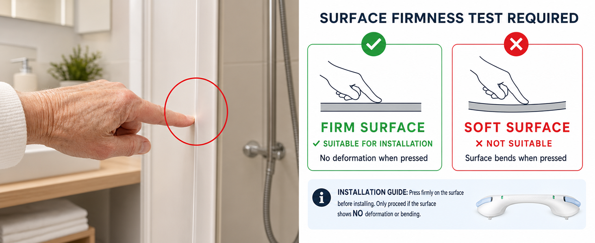

---
hide:
  - toc
---

# Our Products

Discover the complete range of Goldse professional products and equipment.

## 🏢 Featured Brands & Product Lines

### Premium Line
[{ width="200" }](../manuals/index.md)

**Goldse Professional Series**

High-end professional equipment designed for demanding applications.

- Industrial-grade components
- Extended warranty support
- Premium documentation

---

### Standard Line
[{ width="200" }](../manuals/index.md)

**Goldse Standard Series**

Reliable and cost-effective solutions for everyday needs.

- Proven reliability
- Comprehensive guides
- Worldwide support

---

### Value Line
[{ width="200" }](../manuals/index.md)

**Goldse Value Series**

Affordable options without compromising on quality.

- Budget-friendly pricing
- Essential features
- Quick setup guides

## 📂 Product Categories

-   **⚡ Electronic Devices**
    
    Smart electronic tools and advanced control systems. Perfect for technical professionals seeking cutting-edge solutions.
    
    [View Manuals →](../manuals/index.md)

-   **⚙️ Hardware & Appliances**
    
    Industrial-grade machinery and durable appliances. Built for performance and longevity.
    
    [View Manuals →](../manuals/index.md)

-   **🔌 Accessories & Parts**
    
    Essential replacement parts, cables, and supplementary components. Keep your equipment running smoothly.
    
    [View Manuals →](../manuals/index.md)

-   **🛠️ Support & Documentation**
    
    Comprehensive user guides, technical specifications, and troubleshooting resources.
    
    [View Manuals →](../manuals/index.md)

---

## 🌍 Global Distribution

Goldse products are available through authorized distributors worldwide. Find support in your region through our **[Contact Us](../contact.md)** page.
